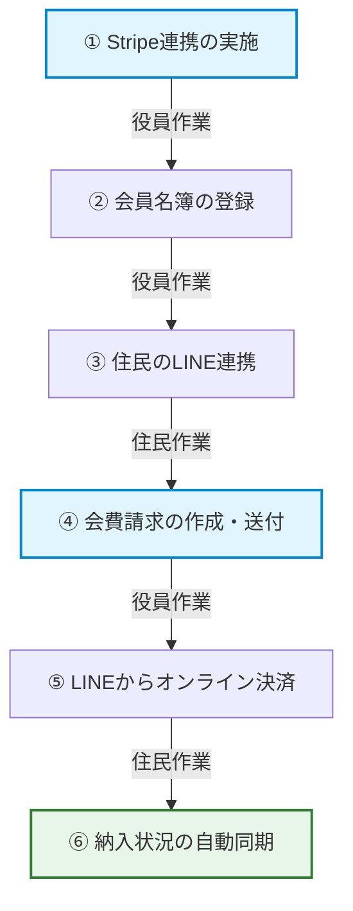

# オンライン集金開始手順の解説 ＆ 管理者向け入力ガイダンス作成計画

ユーザー様からご質問いただいた**「利用開始〜請求〜支払い可能になるまでの手順」**について詳しく整理した上で、役員（管理者）様がスムーズに操作できるようにするための**「入力ガイダンス（マニュアル）の作成計画」**を提案します。

---

## 1. オンライン集金（Stripe決済）利用開始から支払いまでの5つのステップ

町内会がel-townを使い始め、会員（住民）へ請求を行い、住民が支払いを完了して自動的に消し込み（同期）が行われるまでの流れは以下のようになります。

### 【ステップ①】Stripeアカウントの開設と連携（初期設定）
- **作業者**: 町内会管理者（役員）
- **内容**:
  1. 管理者画面の「設定」＞「オンライン集金」タブを開き、最上部に配置された**「決済システム (Stripe) と連携する」**ボタンをクリックします。
  2. 世界最大手のオンライン決済システム「Stripe」のアカウント作成・連携画面（別タブ）に遷移します。
  3. 町内会名義の銀行口座、代表者の本人確認情報、連絡先等を入力して連携手続きを行います（最短5分）。
  4. 登録が完了すると、自動的に el-town に戻り、「連携済み」ステータスになります。

### 【ステップ②】会員名簿の登録
- **作業者**: 町内会管理者（役員）
- **内容**:
  1. 「名簿管理」タブから、町内会員の氏名・郵便番号・住所などを登録します（CSVによる一括取り込み、または画面からの手動登録）。

### 【ステップ③】会員（住民）のLINE公式アカウント友だち追加 ＆ 名簿連携
- **作業者**: 会員（住民）
- **内容**:
  1. 町内会から配布されたチラシ等のQRコードをスマホで読み取り、町内会のLINE公式アカウントを友だち追加します。
  2. トーク画面の下部メニュー（リッチメニュー）から「会員の方」をタップします。
  3. 初回登録画面が開くので、配布された案内に従って「郵便番号」「氏名」を入力して「照合（連携）」をタップします。これでLINEと名簿が紐づきます。

### 【ステップ④】会費請求の作成と自動プッシュ通知
- **作業者**: 町内会管理者（役員）
- **内容**:
  1. 管理者画面の「会費管理」タブで、今年度の請求予定額（例: 年会費 3,000円）を設定します。
  2. 対象者または全員に一括で会費請求を確定（作成）します。
  3. 連携済みのすべての住民のLINEへ、**「〇〇町内会から会費の請求が届きました」**というプッシュ通知が自動的に送信されます。

### 【ステップ⑤】住民によるクレジットカード決済と、納入ステータスの自動更新
- **作業者**: 会員（住民） ＆ システム自動
- **内容**:
  1. 住民はLINEに届いた通知から「お支払い画面」を開き、**「クレジットカードで支払う」**ボタンをタップします。
  2. Stripeの安全な暗号化決済画面にてカード情報を入力し、支払いを完了させます。
  3. **自動消込（同期）**: 決済が完了した瞬間に、管理者画面の「会費管理」テーブル上にある該当住民のステータスが、自動的に**「未納」から「納入済（クレジットカード）」へ更新**されます。
  4. *（補足）* 個別訪問等で現金で回収した世帯については、管理者がテーブルから手動で「納入済（現金）」に切り替えることも可能です。

---

## 2. 管理者向け「入力ガイダンス（マニュアル）」の作成提案

現在、住民向けの操作マニュアルは `/manual` にて、アニメーションで動作するリッチなスマホモックアップ付きの10ステップチュートリアルが稼働しています。

管理者（町内会役員）様向けにも、同様の分かりやすい入力ガイダンスや操作ガイドを新規作成することが可能です。以下の2つのプランを提案いたします。

> [!NOTE]
> 役員の方々のITツールへの習熟度や、普段の作業スタイルに合わせて、最適なプランをお選びいただけます。

### 📌 プランA：【設定タブ内に直組み】Stripe設定タブ内に「クイックスタートガイド」を埋め込む（推奨）
管理者画面の「設定」＞「オンライン集金（Stripe）」タブ内に、アコーディオン（折りたたみ）形式やスタイリッシュなステップカード形式で、画像や図を用いた操作手順ガイドを直接埋め込みます。

- **画面イメージ**:
  - 「Stripeアカウントと連携する」ボタンのすぐ下に、すっきりとしたデザインの「💡オンライン集金の開始手順（3ステップ）」が表示される。
  - 各ステップをクリックすると、詳細な解説や準備するもの（口座情報など）がアコーディオンで展開する。
- **メリット**:
  - 設定作業を行う画面そのものにガイドがあるため、別ページを開く必要がなく、最も迷いにくい。
  - 実用的かつスマートな印象を与える。

### 📌 プランB：【専用ページ新設】管理者専用マニュアルページ（`/manual/admin`）を新規作成する
住民向け操作マニュアルと同様に、PC画面の広さを活かした専用のビジュアルマニュアルページを新設します。

- **画面イメージ**:
  - `/manual/admin` にアクセスすると、大画面のステップバイステップ形式で、管理者が行うべき操作（1. Stripe連携 ➔ 2. 名簿登録 ➔ 3. 請求作成 ➔ 4. LINE送信 ➔ 5. 回収確認）をアニメーションや実際の画面キャプチャを交えて紹介。
- **メリット**:
  - 初めてシステムを導入する際や、年度替わりで役員が交代する際の「引き継ぎ資料・研修資料」としてそのまま活用できる。
  - 情報量が豊富で、じっくり手順を読みたい場合に適している。

---

## Open Questions（ユーザー様へのご確認）

> [!IMPORTANT]
> ガイダンスの作成方針について、ユーザー様のご意向をお聞かせください。
> 
> 1. **ご希望のプランについて**:
>    - **プランA（設定タブ内へ直組み）**が良いか、**プランB（専用マニュアルページ新設）**が良いか、あるいは**「両方」**（設定タブ内には簡易ガイド、詳細は別ページ）が良いか、ご希望を教えていただけますでしょうか？
> 2. **他に記載してほしい内容**:
>    - ガイダンス内に「これは特に注意書きとして載せてほしい」という内容（例: 手数料に関する説明、使えるクレジットカードの種類、現金集金との併用方法など）があれば、ぜひ教えてください。

---

## 提案・決定後の実装の流れ
1. **ユーザー様からのフィードバック受領**: ご希望のプランを決定します。
2. **デザイン・文面の作成**: 決定したプランに基づき、管理者向けガイダンスのUIおよび解説文を設計します。
3. **コーディングと実装**: `AdminView.tsx` または新規の `/manual/admin/page.tsx` を作成・編集します。
4. **ビルドテスト・本番デプロイ**: `npm run build` を通し、Netlifyへデプロイして本番環境で表示を確認します。
