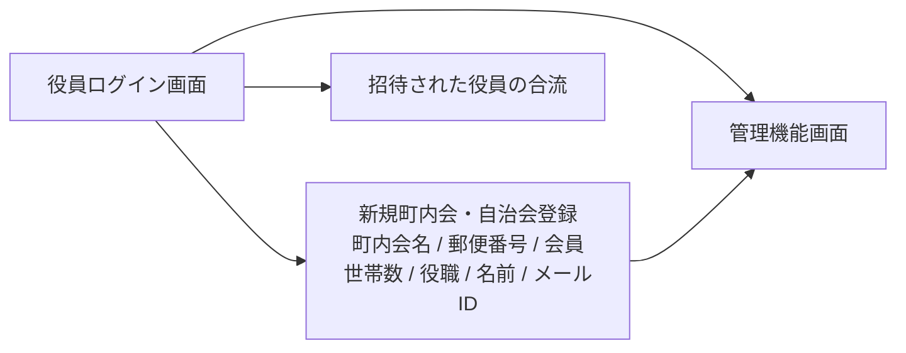
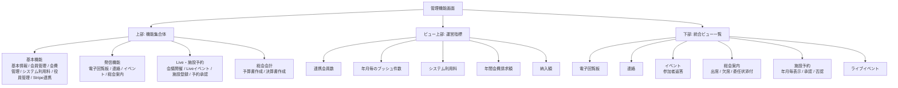

# 管理機能画面 構成メモ

作成日: 2026-07-06

## 画面構成

### 入口

### 管理機能画面

## 実装反映

- `components/AdminView.tsx` に、4つの機能集合体、5つの運営指標、統合ビュー一覧を反映。
- 管理画面ロゴを初期メニューと同じ横長ロゴ `/assets/logo_horizontal_final.png` に変更。
- 役員ログイン画面に「新規の町内会・自治会を登録する」導線を復旧。
- `components/SignupTown.tsx` に、町内会・自治会名、郵便番号、会員世帯数、役職、名前、メールID、ログインパスワードの登録フォームを復旧。
- 会員世帯数は `500世帯未満`、`500世帯～1000世帯`、`1000世帯～5000世帯`、`5000世帯以上` から選択し、基本情報にも同じ値を反映。
- 登録時に `neighborhoods` へ基本情報、`neighborhood_admins` へ初期役員情報を保存。
- 基本機能の各項目をタブ/チップで切り替えられるUIとして復旧。
  - 基本情報
  - 会員管理
  - 会費管理
  - システム利用料
  - 役員管理
  - Stripe連携
- 会員管理はサマリーではなく、CSV取込み/CSV出力、画面入力による名簿登録、LINE連携状態、システム利用料対象、退会申請承認、復活を扱う画面として構成。
- 会員名簿項目は、氏名、氏名カタカナ、郵便番号、住所２、住所３、家族１、家族２を基本とし、初回LINE連携時の照合情報として使用。
- LINE連携済み会員はシステム利用料対象、未連携会員は対象外として表示。家族1・家族2がLINE連携した場合も、それぞれ料金対象アカウントとして加算。
- 会員一覧の編集ボタンから、氏名、氏名カタカナ、郵便番号、住所２、住所３、家族１、家族２を更新可能。
- 退会承認時は `withdrawal_status = withdrawn` とし、同じ町内会・自治会ではel-townを利用不可にする。復活操作も用意。
- 会費管理は会計年度ごとに、全会員世帯またはチェックした会員へ請求額を設定できる画面として構成。
- Stripe請求対象の設定、手集金による入金入力、Stripe入金の自動反映用Webhook、入金方法の区分表示を追加。
- 会員側の会費タブは、役員が請求設定した場合に請求額、入金額、状態、入金方法、オンライン支払い/領収書を表示。
- 退会済み会員の会費情報は削除せず、一括請求対象から除外する。年度集計は退会済みでも入金済みまたは一部入金の会費を含め、入金ゼロの退会済み会費は除外。
- 施設予約、Live、総会案内はDB統合前でも一覧に表示されるよう、フォールバック行を表示。
- `app/admin/page.tsx` に開発環境限定の `?test_bypass=1` 確認導線を追加。本番環境では無効。
