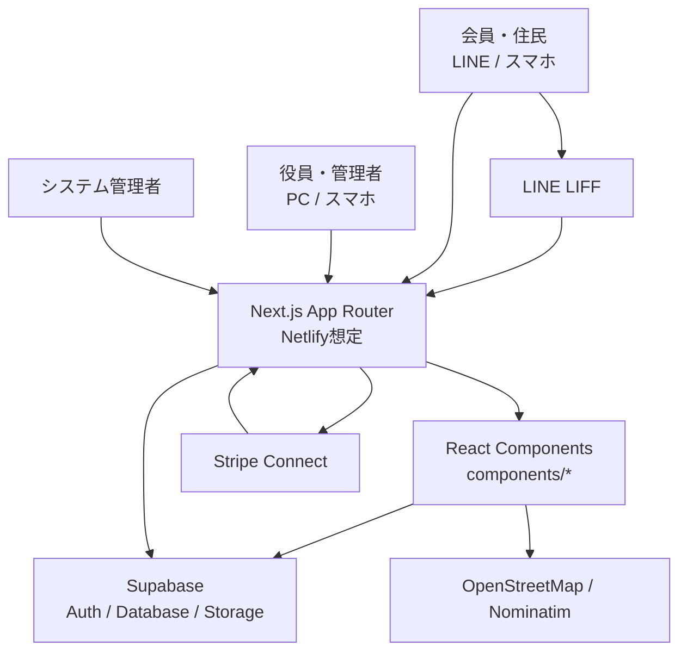
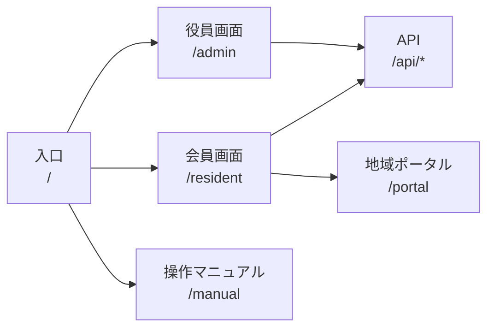

# el-town システム構成図 ブラッシュアップ版

作成日: 2026-07-06  
対象: `C:\Users\info\.gemini\antgravity`  
目的: 現行ソース、scratch、2026-06-25バックアップを踏まえ、実装済み・復旧候補・未実装を切り分ける。

## 全体構成

## 機能別構成

## 実装状況

| 区分 | 機能 | 状況 | 主な場所 |
|---|---|---|---|
| 共通 | 初期メニュー | 実装済み、文字化け復旧対象 | `app/page.tsx` |
| 共通 | LIFF連携 | 実装済み | `components/LiffProvider.tsx` |
| 役員 | 管理ダッシュボード | 実装済み、UI復旧対象 | `components/AdminView.tsx` |
| 役員 | 回覧板・通知 | 旧実装あり | `scratch/qoin/src/components/AdminView.tsx.bak` |
| 役員 | イベント発信 | 旧実装あり | `AdminView.tsx.bak`, `AdminView.tsx.broken` |
| 役員 | イベント参加返信管理 | 旧実装あり | `event_applications` 参照箇所 |
| 役員 | 会費・請求 | 旧実装あり | `fee_records` 参照箇所 |
| 役員 | システム料金計算・請求 | 旧実装あり | `system_settings`, `platform_payments` 参照箇所 |
| 役員 | 総会予算・決算 | scratch断片あり | `scratch/assembly_backend.tsx`, `scratch/assembly_ui.tsx` |
| 役員 | 総会通知・返信 | 未実装 | 委任状印刷ページのみ存在 |
| 役員 | 施設予約設定 | 未実装または未統合 | マニュアル中心 |
| 役員 | Live発信 | 未実装または未統合 | マニュアル中心 |
| 会員 | 回覧板表示 | 実装済み、UI復旧対象 | `components/ResidentView.tsx` |
| 会員 | イベント参加返信 | 旧ログ/断片あり、現行未統合 | バックアップ/brainログ |
| 会員 | 施設予約 | 旧ログ/断片あり、現行未統合 | バックアップ/brainログ |
| 会員 | Live参加 | 旧ログ/断片あり、現行未統合 | バックアップ/brainログ |
| 会員 | 退会申請 | 旧ログ/断片あり、現行未統合 | バックアップ/brainログ |

## 復旧方針

1. UI文字化けの復旧
   - `app/layout.tsx`
   - `app/page.tsx`
   - `components/AdminView.tsx`
   - `components/ResidentView.tsx`

2. デザインの復旧
   - 既存の `styles/design.css` を活かす。
   - 画面骨格はカード乱立を避け、管理画面は業務ダッシュボード、会員画面はスマホ操作向けに整理する。
   - 入口画面は既存のロゴ、色、アイコン導線を維持する。

3. 機能移植
   - `AdminView.tsx.bak` / `.broken` は丸ごと戻さず、イベント、会費、システム料金ごとに分割して移植する。
   - 総会予算・決算は `assembly_backend.tsx` と `assembly_ui.tsx` を独立モジュール化してから統合する。
   - 総会通知・返信、施設予約、LiveはDBテーブル設計を先に追加する。

## 優先順位

1. 入口、管理、会員の文字化けUI復旧
2. システム構成図と機能一覧の最新版保存
3. 役員側イベント発信・参加返信の復旧
4. 会費・システム料金請求の復旧
5. 施設予約、Live、総会通知・返信の新規実装
