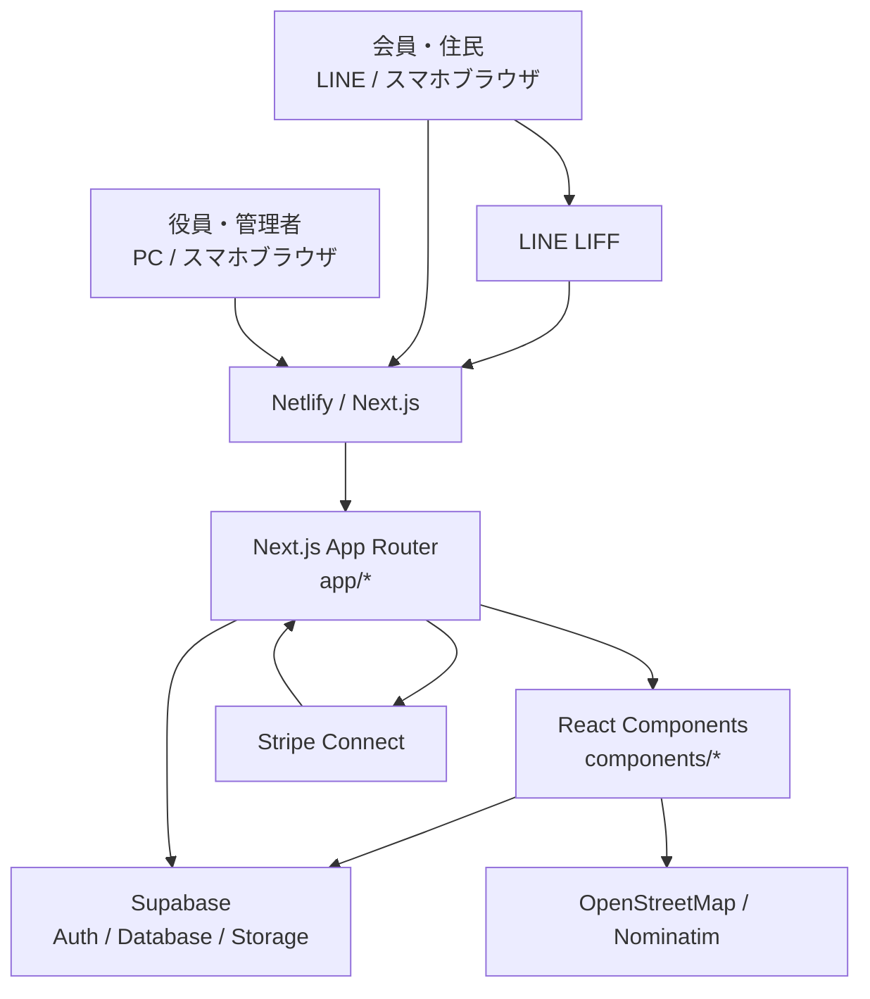
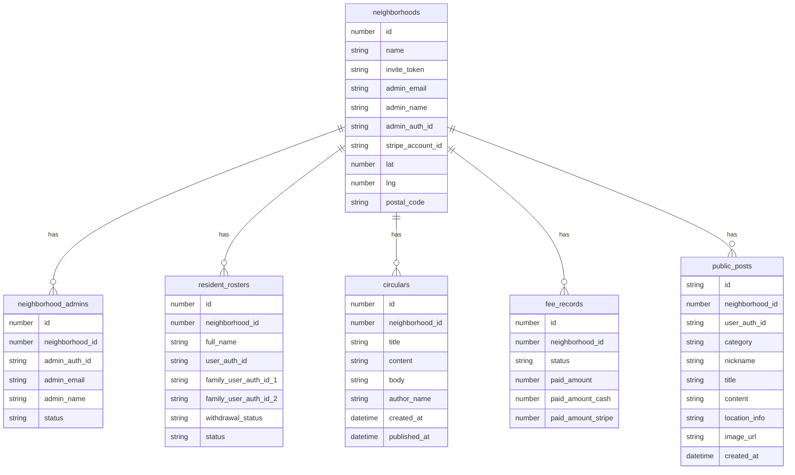

# el-town 機能別システム構成図

作成日: 2026-07-05  
対象ソース: `qoin-inc/qoin` `main` 相当の `C:\Users\info\.gemini\antgravity`

## 1. 全体像

el-town は、町内会・自治会向けの LINE/スマホ利用を前提にした Next.js アプリです。画面は Next.js App Router で構成され、認証・データ保存は Supabase、決済事業者登録は Stripe Connect、LINE アプリ内利用は LIFF で実現します。本番公開は Netlify です。



## 2. 機能別構成

### 2.1 初期メニュー・入口

対象:
- `app/page.tsx`
- `components/InitialRedirectHandler.tsx`
- `components/LiffProvider.tsx`
- `public/assets/logo_horizontal_final.png`

役割:
- 最初に表示するメニュー画面を表示します。
- メニュー順は `役員の方`、`会員の方`、`操作方法` です。
- `redirect` / `goto` / `open` / `liff.state` の URL パラメータを見て、会員画面・役員画面・ポータル画面・個別回覧へ遷移します。
- LIFF プロフィールが取得できる場合は、既存会員かどうかを `resident_rosters` で確認し、会員画面へ自動遷移します。

```mermaid
flowchart TD
  A[トップ /] --> B{URLパラメータあり?}
  B -->|admin| C[/admin]
  B -->|resident| D[/resident]
  B -->|portal| E[/portal]
  B -->|open=ID| F[/resident?open=ID]
  B -->|なし| G[初期メニュー表示]
  G --> H[役員の方]
  G --> I[会員の方]
  G --> J[操作方法]
  H --> C
  I --> D
  J --> K[/manual]
  A --> L[LIFF profile]
  L --> M[resident_rosters 照会]
  M -->|登録済み| D
```

### 2.2 役員・管理者機能

対象:
- `app/admin/page.tsx`
- `components/AdminView.tsx`
- `components/SignupTown.tsx`
- `components/BudgetForm.tsx`
- `pages/admin/budget.tsx`
- `app/admin/stripe/refresh/page.tsx`
- `app/admin/stripe/return/page.tsx`

役割:
- メールアドレスとパスワードで Supabase Auth にログインします。
- 町内会・自治会を新規登録できます。
- 役員招待・参加・承認待ちステータスを `neighborhood_admins` で管理します。
- 管理画面では会員数、回覧数、未納件数、入金額を集計表示します。
- 管理モジュールとして、会員管理、回覧板・通知、会費管理、予算・決算、イベント、システム設定を想定しています。

```mermaid
flowchart TD
  A[/admin] --> B{ログイン済み?}
  B -->|No| C[ログイン / 新規登録 / 招待参加]
  C --> D[Supabase Auth]
  C --> E[neighborhoods 登録]
  C --> F[neighborhood_admins 登録・確認]
  B -->|Yes| F
  F -->|active| G[AdminView]
  F -->|waiting_approval| H[承認待ち]
  F -->|rejected| I[利用不可]
  G --> J[resident_rosters 集計]
  G --> K[circulars 集計]
  G --> L[fee_records 集計]
  G --> M[管理モジュール一覧]
```

主な Supabase テーブル:
- `neighborhoods`: 町内会・自治会情報、招待トークン、Stripe アカウントIDなど
- `neighborhood_admins`: 役員アカウント、所属自治会、承認ステータス
- `resident_rosters`: 会員名簿
- `circulars`: 回覧・通知
- `fee_records`: 会費・入金情報

### 2.3 会員・住民機能

対象:
- `app/resident/page.tsx`
- `components/ResidentView.tsx`
- `components/SignupResident.tsx`
- `app/resident/proxy/page.tsx`
- `app/resident/receipt/page.tsx`

役割:
- LINE LIFF でログインし、LIFF の `userId` をもとに Supabase Auth の疑似メールアカウントを作成・ログインします。
- `resident_rosters` から会員名簿を取得し、所属する町内会・自治会を `neighborhoods` から取得します。
- 未登録の場合は、町内会名、郵便番号、住所２、必要に応じて住所３、お名前で既存名簿を照合し、LINEアカウントを連携します。招待コードは役員招待で使用します。
- 会員画面では、ホーム、回覧、会費、プロフィールのタブを表示します。
- `open` パラメータにより、特定の回覧を直接開けます。
- 委任状・領収書の印刷用ページを提供します。

```mermaid
flowchart TD
  A[/resident] --> B{Supabase sessionあり?}
  B -->|No| C[LINE LIFF login]
  C --> D[LIFF profile 取得]
  D --> E[Supabase Auth\nlineUserId@line.eltown.local]
  B -->|Yes| F[resident_rosters 検索]
  E --> F
  F -->|未登録| G[SignupResident\n名簿照合入力]
  G --> H[resident_rosters LINE連携更新]
  F -->|登録済み| I[neighborhoods 取得]
  I --> J[ResidentView]
  J --> K[circulars 一覧]
  J --> L[会費タブ]
  J --> M[プロフィール]
  J --> N[委任状 / 領収書]
```

主な Supabase テーブル:
- `resident_rosters`: 会員情報、LINE連携ID、退会ステータス、家族ユーザーID
- `neighborhoods`: 所属町内会・自治会
- `circulars`: 回覧板データ

### 2.4 ポータル・地域投稿機能

対象:
- `app/portal/page.tsx`
- `components/MapComponent.tsx`

役割:
- 会員ログイン後に利用する地域ポータルです。
- `public_posts` を取得し、カテゴリ別に表示します。
- 投稿カテゴリは、ソース上では `food` と `sight` を使用しています。
- 投稿に画像がある場合は Supabase Storage の `attachments` バケットへアップロードします。
- 町内会・自治会に緯度経度が無い場合、郵便番号から Nominatim を使って緯度経度を補完します。
- 地図表示では Leaflet を動的 import し、町内会ごとの投稿を地図と連動して表示します。

```mermaid
flowchart TD
  A[/portal] --> B[Supabase session 確認]
  B -->|なし| C[/resident へ誘導]
  B -->|あり| D[resident_rosters 取得]
  D --> E[neighborhoods 取得]
  E --> F[public_posts 取得]
  F --> G[カテゴリ表示 food / sight]
  F --> H[地図表示 map]
  G --> I[投稿作成・編集・削除]
  I --> J[Supabase Storage attachments]
  I --> K[public_posts insert/update/delete]
  E -->|lat/lngなし| L[Nominatim geocoding]
  L --> M[neighborhoods lat/lng 更新]
```

主な Supabase テーブル・ストレージ:
- `public_posts`: 地域投稿
- `neighborhoods`: 投稿元の町内会・自治会、緯度経度
- Storage `attachments`: 投稿画像

### 2.5 Stripe 連携

対象:
- `app/api/admin/stripe/create-account-link/route.ts`
- `app/api/webhooks/stripe/route.ts`
- `app/admin/stripe/refresh/page.tsx`
- `app/admin/stripe/return/page.tsx`

役割:
- 役員画面から Stripe Connect Express アカウントを作成します。
- `neighborhoods.stripe_account_id` に Stripe アカウントIDを保存します。
- Stripe のオンボーディングリンクを発行し、Stripe 側の登録画面へ遷移します。
- webhook では `account.updated` を受信し、オンボーディング完了状態を検知する設計です。

```mermaid
flowchart TD
  A[役員画面] --> B[/api/admin/stripe/create-account-link]
  B --> C[neighborhoods 取得]
  B --> D[neighborhood_admins から管理者メール取得]
  B --> E{stripe_account_id あり?}
  E -->|なし| F[Stripe Express Account 作成]
  F --> G[neighborhoods.stripe_account_id 保存]
  E -->|あり| H[既存アカウント使用]
  G --> I[Account Link 発行]
  H --> I
  I --> J[Stripe onboarding]
  J --> K[/admin/stripe/return]
  J --> L[/admin/stripe/refresh]
  StripeWebhook[Stripe webhook] --> M[/api/webhooks/stripe]
  M --> N[account.updated 処理]
```

必要な環境変数:
- `STRIPE_SECRET_KEY`
- `STRIPE_WEBHOOK_SECRET`
- `NEXT_PUBLIC_BASE_URL`

### 2.6 マニュアル・リッチメニュー・システム画面

対象:
- `app/manual/page.tsx`
- `app/manual/admin/page.tsx`
- `app/manual/member/page.tsx`
- `app/manual/live/page.tsx`
- `app/manual/stripe/page.tsx`
- `components/ManualViewer.tsx`
- `app/richmenu/page.tsx`
- `app/system/page.tsx`
- `components/SystemAdminView.tsx`

役割:
- `/manual` 配下で操作説明を提供します。
- `/richmenu` は LINE リッチメニュー関連の確認・表示用ページです。
- `/system` はシステム管理系画面として用意されています。

## 3. 画面・API 対応表

| 区分 | パス | 主なファイル | 役割 |
|---|---|---|---|
| 初期メニュー | `/` | `app/page.tsx` | 入口、メニュー、URLパラメータ遷移 |
| LIFF共通 | 共通 | `components/LiffProvider.tsx` | LIFF初期化、プロフィール取得 |
| 初期リダイレクト | `/` | `components/InitialRedirectHandler.tsx` | 既存会員判定、直接遷移 |
| 役員画面 | `/admin` | `app/admin/page.tsx`, `components/AdminView.tsx` | 役員ログイン、管理ダッシュボード |
| 自治会登録 | `/admin?mode=signup` | `components/SignupTown.tsx` | 町内会・自治会と初期役員登録 |
| 会員画面 | `/resident` | `app/resident/page.tsx`, `components/ResidentView.tsx` | LINEログイン、回覧、会費、プロフィール |
| 会員登録 | `/resident?mode=signup` | `components/SignupResident.tsx` | 町内会名・郵便番号・住所２/３・氏名による名簿照合 |
| ポータル | `/portal` | `app/portal/page.tsx` | 地域投稿、地図、画像投稿 |
| 委任状 | `/resident/proxy` | `app/resident/proxy/page.tsx` | 印刷用委任状 |
| 領収書 | `/resident/receipt` | `app/resident/receipt/page.tsx` | 印刷用領収書 |
| Stripe口座作成 | `/api/admin/stripe/create-account-link` | `route.ts` | Stripe Connect onboarding URL 発行 |
| Stripe webhook | `/api/webhooks/stripe` | `route.ts` | Stripeイベント受信 |
| マニュアル | `/manual/*` | `app/manual/*` | 操作説明 |
| 予算画面 | `/admin/budget` | `pages/admin/budget.tsx` | 予算入力・管理 |

## 4. データモデル概略

ソースから確認できる主なテーブルは以下です。



## 5. 外部サービスと環境変数

| 外部サービス | 用途 | 関連ファイル | 主な環境変数 |
|---|---|---|---|
| Supabase Auth | 役員ログイン、会員LINE連携ログイン | `lib/supabaseClient.ts`, `app/admin/page.tsx`, `app/resident/page.tsx` | `NEXT_PUBLIC_SUPABASE_URL`, `NEXT_PUBLIC_SUPABASE_ANON_KEY` |
| Supabase Database | 町内会、役員、会員、回覧、会費、投稿の保存 | 各画面・API | 同上 |
| Supabase Storage | ポータル投稿画像の保存 | `app/portal/page.tsx` | 同上 |
| LINE LIFF | LINE内ログイン、プロフィール取得 | `components/LiffProvider.tsx`, `app/resident/page.tsx` | `NEXT_PUBLIC_LIFF_ID` |
| Stripe Connect | 自治会の決済口座オンボーディング | `app/api/admin/stripe/create-account-link/route.ts` | `STRIPE_SECRET_KEY`, `STRIPE_WEBHOOK_SECRET`, `NEXT_PUBLIC_BASE_URL` |
| OpenStreetMap / Nominatim | 郵便番号から緯度経度取得 | `app/portal/page.tsx` | なし |
| Netlify | 本番ホスティング、Next.js Runtime | `netlify.toml` | Netlify 側に設定 |

## 6. 現時点の注意点

- ソース内に文字化けしている日本語文言があります。UI表示やドキュメント品質のため、別タスクで文言修復を行うのが望ましいです。
- `lib/supabaseClient.ts` は環境変数がない場合に placeholder を使います。本番では Netlify の環境変数設定が必須です。
- Stripe webhook は `account.updated` の検知まで実装されていますが、DBのステータス更新はコメント扱いの箇所があります。運用要件に応じて確定実装が必要です。
- 役員画面の管理モジュールは UI 上の入口が中心で、会員管理・会費管理などの詳細CRUDは今後の実装範囲が残っている可能性があります。
- `app/portal/page.tsx` は機能量が多く、投稿、地図、画像アップロード、リッチメニュー風UIが1ファイルに集約されています。保守性を上げるなら機能別コンポーネント分割が有効です。
