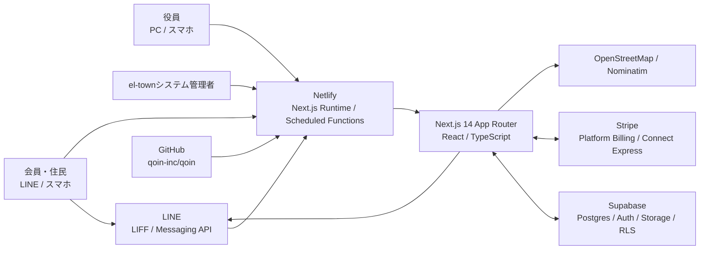

# el-town システム構成・災害復旧手順書

- スナップショット日: 2026-07-19（JST）
- 文書種別: 日付固定の構成スナップショット
- 対象システム: el-town 本番環境
- 本番URL: `https://el-town.jp`
- GitHub: `https://github.com/qoin-inc/qoin.git`
- 基準ブランチ: `deploy-ui-restore`
- 基準コミット: `fcea18160c000b5912abe4d4708f7536b00963fb`
- 基準デプロイID: `6a5c9ac8cfcba500740400e7`
- 作業ディレクトリ: `C:\Users\info\Documents\Codex\projects\el-town`

## 1. 目的と更新規則

この文書は、開発PC、GitHub、Netlify、Supabaseまたは主要な設定が失われた場合に、el-townを再構築するための基準情報を残すものである。

今後、システム構成を更新するときはこのファイルを上書きしない。次の命名で新規保存し、作成日の実装・外部設定・未解決事項を改めて棚卸しする。

```text
docs/reports/system_architecture_recovery_YYYY-MM-DD.md
```

同日に複数回スナップショットを残す場合は `_2`、`_3` を付ける。最新文書はファイル名の日付と基準コミットで判断する。日報にも新規構成書のファイル名を追記する。

## 2. 復旧可能性の結論

### Gitから復元できるもの

- Next.js・React・TypeScriptのソースコード
- API Route、Netlify Scheduled Functions
- UI、CSS、ロゴ、アイコン等の静的資産
- 2026-07-19までに追加された差分SQL
- Netlifyビルド設定と承認付きデプロイスクリプト
- Stripe、LINE、Supabase連携処理
- 操作マニュアルと運用資料

### Gitだけでは復元できないもの

- Supabase本番DBの現在データ
- `auth.users` を含む認証データの最新状態
- Supabase Storage `attachments` バケットの実ファイル
- Netlify環境変数の秘密値
- Stripe本番APIキー、Webhook署名シークレット、Customer、Invoice、Connectアカウント等のStripe側オブジェクト
- LINE Developers・Messaging API・LIFF・リッチメニューの外部設定
- DNS、ドメイン所有権、Netlifyサイト所有権
- Supabase、Stripe、LINE、GitHub、Netlify各組織のメンバー権限

したがって、コードのGit保存だけでは完全復旧できない。DB論理バックアップ、Storage実体コピー、外部サービス設定台帳、秘密情報の安全な保管が揃って初めて復旧可能となる。

## 3. 全体構成



### 責務

| レイヤー | 製品・技術 | 主な責務 |
|---|---|---|
| クライアント | Webブラウザ、LINE内ブラウザ | 役員・会員・システム管理UI |
| フロントエンド | Next.js、React、TypeScript | 画面、状態管理、Supabaseクライアント処理 |
| サーバー | Next.js Route Handler、Netlify Functions | 秘密キーを使う処理、Stripe、LINEプッシュ、定期請求 |
| データ | Supabase Postgres | 業務データ、RLS、Auth関連データ |
| ファイル | Supabase Storage | `attachments` バケットの画像・添付ファイル |
| 認証 | Supabase Auth、LIFF、独自systemセッション | 役員・会員・システム管理者の認証 |
| 決済 | Stripe Platform、Stripe Connect Express | システム使用料、団体会費、入金同期、手数料 |
| 通知 | LINE Messaging API | 回覧・イベント等のプッシュ通知 |
| ホスティング | Netlify | 本番ビルド、配信、環境変数、Scheduled Functions |
| ソース管理 | Git、GitHub | コード・構成資料・履歴の保全 |

## 4. 開発環境とツール

### 2026-07-19の確認値

| 項目 | 現在値 |
|---|---|
| OS | Windows / PowerShell |
| Node.js（現在のローカル） | `v24.14.1` |
| npm | `11.11.0` |
| Git | `2.54.0.windows.1` |
| Netlify CLI（グローバル） | `26.1.0` |
| Supabase CLI（グローバル） | `2.109.0` |
| GitHub CLI | 未導入 |
| Dev Container | `mcr.microsoft.com/devcontainers/typescript-node:22` |
| GitHub Actions Node | `20` |

Node.jsの基準がローカル24、Dev Container 22、GitHub Actions 20で一致していない。復旧時の再現性確保のため、今後LTS 22等へ一本化し、`.nvmrc` または `package.json` の `engines` とNetlifyのNode指定を追加することが望ましい。現時点で最も明示的な開発基準はDev ContainerのNode 22である。

### 基本コマンド

```powershell
git clone https://github.com/qoin-inc/qoin.git el-town
Set-Location el-town
git switch deploy-ui-restore
git checkout fcea18160c000b5912abe4d4708f7536b00963fb
npm ci
npm.cmd run build
npm.cmd run dev
```

通常開発ではdetached HEADのまま作業せず、復旧確認後に基準コミットから復旧用ブランチを作成する。

```powershell
git switch -c recovery-2026-07-19
```

### npm scripts

| コマンド | 用途 |
|---|---|
| `npm run dev` | Next.js開発サーバー |
| `npm run build` | 本番ビルド |
| `npm run start` | ビルド済みNext.js起動 |
| `npm run deploy:plan -- --prod` | 本番デプロイ計画と承認文字列の生成 |
| `npm run deploy:approved ...` | 完全一致する承認後の本番デプロイ |

`lint` と `test` のnpm scriptは現在存在しない。

## 5. 言語・フレームワーク・依存関係

| 分類 | 製品 | バージョン・設定 |
|---|---|---|
| 言語 | TypeScript、JavaScript、CSS、SQL | TypeScript中心、一部JS/MJS/MTS |
| Webフレームワーク | Next.js | `14.2.5`、App Router中心 |
| UI | React / React DOM | `18.3.1` |
| DBクライアント | `@supabase/supabase-js` | `2.44.4` |
| 決済SDK | `stripe` | `^13.0.0`、API version指定は `2025-02-24.acacia` |
| LINE | `@line/liff` | `^2.25.0` |
| 地図 | Leaflet | `^1.9.4` |
| CSS補助 | Tailwind CSS | `^3.3.2`だが、Tailwind設定ファイルは存在せず、主にユーティリティ風クラスと独自CSSを使用 |
| 型 | `@types/react` | `19.2.17`。React 18との世代差に注意 |
| TypeScriptコンパイラ | TypeScript | `6.0.3` |

`package-lock.json` を必ず保存して `npm ci` を使う。2026-07-19時点の検証値は次のとおり。

- `package.json` SHA-256: `4D97F78FC59A18AC77FE5F3841BFB83C0C3426B3772D939B7D5511BAFA10966A`
- `package-lock.json` SHA-256: `4A827FCFFE35BFEE034B9B235539BF3C556E6B58180F7A8C60FFBD453CE2B90F`

### TypeScript・Next.js設定

- `next.config.js`: React Strict Mode有効、SWC minify有効
- `tsconfig.json`: `noEmit=true`、`strict=false`、`strictNullChecks=true`
- パスエイリアス: `@/*`、`@/components/*`、`@/lib/*`
- `allowJs=true`
- Next.js App Routerが主だが、`pages/admin/budget.tsx` にPages Routerが1画面残る

## 6. Git・GitHub構成

### 現在のGit情報

| 項目 | 値 |
|---|---|
| remote | `origin https://github.com/qoin-inc/qoin.git` |
| 現在ブランチ | `deploy-ui-restore` |
| origin HEAD | `origin/deploy-ui-restore` |
| 基準コミット | `fcea18160c000b5912abe4d4708f7536b00963fb` |
| 他の確認済みremote branch | `main`、`backup-before-reset`、`feature/ui-restoration`、`restored-6-19` |

リポジトリ名は `qoin`、サービス名は `el-town` で一致しないため、復旧時に別リポジトリと誤認しないこと。

### Gitバックアップ

GitHub障害・誤削除に備え、別媒体へ定期的にmirror cloneを保管する。

```powershell
git clone --mirror https://github.com/qoin-inc/qoin.git qoin-el-town.git
```

mirrorはGitHubと同じアカウント内だけでなく、暗号化した外部ストレージへ複製する。GitHub公式も履歴を含むバックアップにはmirror cloneを案内している。

### 現在のGitHub Actionsの状態

`.github/workflows/ci.yml` は現状の構成と不一致があり、災害復旧手段として信用しない。

- `npm run lint` と `npm test` を実行するが、該当scriptがない。
- DBバックアップで `scripts/backup-db.sh` を呼ぶが、そのファイルがない。
- 監視パスに `app/**`、`lib/**`、`netlify/**`、`styles/**` が含まれない。
- デプロイ先を `./out` とするが、現在のNetlify構成は `.next` とNext.js pluginを使用する。
- `main` と `develop` だけを対象とするが、現在の既定・本番基準ブランチは `deploy-ui-restore`。

CI/CDを修正して実際に成功するまで、復旧・デプロイは `docs/admin/safe-deployment.md` と承認付きローカル手順を正とする。

## 7. Netlify構成

| 項目 | 値 |
|---|---|
| siteName | `el-town` |
| publicUrl | `https://el-town.jp` |
| build command | `npm run build` |
| publish/artifact | `.next` |
| plugin | `@netlify/plugin-nextjs` |
| デプロイ承認有効時間 | 15分 |
| 設定ファイル | `netlify.toml`、`deploy.config.json` |

### 本番デプロイ

1. 変更をコミットし、GitHubへpushする。
2. `npm.cmd run build` を成功させる。
3. `npm.cmd run deploy:plan -- --prod` を実行する。
4. 出力された `APPROVE DEPLOY ...` を利用者が完全一致で承認する。
5. 計画に表示された `deploy:approved` コマンドを実行する。
6. 公開URL、コミットID、build ID、deploy IDを照合する。

デプロイ履歴はローカル `.deploy/deployments.jsonl` にあるがGit管理外である。復旧証跡として必要なら秘密情報を含まない形で別保管する。

### Scheduled Functions

| 関数 | 実行 |
|---|---|
| `netlify/functions/system-usage-snapshot.mts` | 毎月16日00:00 UTC＝9:00 JST |
| `netlify/functions/system-usage-invoice.mts` | 毎月1日00:00 UTC＝9:00 JST |

請求開始前は `SYSTEM_BILLING_ENABLED=false` を維持する。

## 8. 環境変数台帳

秘密値はこの文書、Git、画面共有、ログへ記載しない。値はアクセス制限・監査ログ・MFAのあるパスワード管理基盤に保管し、少なくとも二人が復旧経路を知る状態にする。

### ブラウザへ公開される設定

| 変数 | 用途 |
|---|---|
| `NEXT_PUBLIC_SUPABASE_URL` | Supabase Project URL |
| `NEXT_PUBLIC_SUPABASE_ANON_KEY` | Supabase公開anon key。RLS前提 |
| `NEXT_PUBLIC_LIFF_ID` | LINE LIFFアプリID |
| `NEXT_PUBLIC_BASE_URL` | Stripe onboarding等の戻り先 |
| `NEXT_PUBLIC_APP_URL` | Checkoutの成功・キャンセル戻り先 |

### サーバー限定の秘密情報

| 変数 | 用途 |
|---|---|
| `SUPABASE_SECRET_KEY` | Webhook・管理API・定期処理用。`NEXT_PUBLIC_` を付けない |
| `SUPABASE_SERVICE_ROLE_KEY` | 旧環境との互換用。原則は `SUPABASE_SECRET_KEY` |
| `STRIPE_SECRET_KEY` | Stripe本番APIキー |
| `STRIPE_WEBHOOK_SECRET` | el-townプラットフォームWebhook署名 |
| `STRIPE_CONNECT_WEBHOOK_SECRET` | ConnectイベントWebhook署名 |
| `LINE_CHANNEL_ACCESS_TOKEN` | LINEプッシュ用トークン |
| `LINE_MESSAGING_CHANNEL_ACCESS_TOKEN` | 上記の互換名 |
| `SYSTEM_LOGIN_ID` | `/system` ログインID |
| `SYSTEM_LOGIN_PASSWORD` | `/system` パスワード |
| `SYSTEM_SESSION_SECRET` | systemログインCookieトークン生成用 |
| `SYSTEM_ADMIN_EMAIL` | system管理用Supabaseユーザー |
| `SYSTEM_BILLING_CRON_SECRET` | 定期請求APIの共有秘密 |
| `SYSTEM_BILLING_ENABLED` | 請求停止スイッチ。`true` のみ有効 |
| `NETLIFY_AUTH_TOKEN` | ローカルの承認付きデプロイ用。アプリRuntimeへ不要 |

Netlifyが自動提供する `URL`、`DEPLOY_PRIME_URL` もScheduled Functionsが参照する。

### 緊急の秘密情報リスク

2026-07-19の確認で `.env.local` がGit追跡対象になっている。現在の `.gitignore` には記載されているが、既に追跡されたファイルには効かない。少なくとも `NETLIFY_AUTH_TOKEN` が含まれるため、次を別の承認付きセキュリティ作業として実施する。

1. 含まれる全秘密値を失効・ローテーションする。
2. `.env.local` をGit追跡から外す。
3. 必要ならGit履歴から秘密値を除去する。履歴書き換えは全利用者との調整後に行う。
4. GitHub Secret Scanningと組織監査ログを確認する。
5. 秘密値を記載しない `.env.example` を作成する。

## 9. フォルダー構成

```text
el-town/
├─ app/                    Next.js App Router画面・API
│  ├─ api/                Route Handlers
│  ├─ admin/              役員画面・Stripe onboarding戻り先
│  ├─ resident/           会員画面・委任状・領収書
│  ├─ system/             el-townシステム管理画面
│  ├─ portal/             地域投稿・地図
│  ├─ manual/             操作マニュアル
│  └─ richmenu/           LINEリッチメニュー関連画面
├─ components/             React UI・業務画面
├─ lib/                    Supabase、Stripe、system請求サーバー処理
├─ netlify/functions/      Scheduled Functions
├─ pages/                  旧Pages Router。予算画面が残る
├─ public/                 ロゴ、アイコン、favicon
├─ styles/                 大規模共通CSS
├─ docs/
│  ├─ admin/              デプロイ等の管理手順
│  ├─ architecture/       過去の構成資料
│  ├─ integrations/       Stripe等の連携資料
│  ├─ reports/            日報・日付付き復旧スナップショット
│  └─ sql/                日付付き差分SQL
├─ scripts/                承認付きNetlifyデプロイ
├─ .github/workflows/      GitHub Actions
├─ .devcontainer/          Node 22開発コンテナ
├─ package.json
├─ package-lock.json
├─ netlify.toml
├─ deploy.config.json
├─ next.config.js
└─ tsconfig.json
```

### Git管理外・再生成可能

- `node_modules/`: `npm ci` で再作成
- `.next/`: `npm run build` で再作成
- `.netlify/`: Netlify CLIが再作成
- `.deploy/`: ローカルデプロイ計画・履歴
- `preview/`: ローカル確認用

### 保守上の注意

- `components/AdminView.tsx` は約268KB、`ResidentView.tsx` は約98KBで、機能が集中している。
- `styles/design.css` は約127KBで、多数の画面スタイルが集中している。
- 復旧時に急いでファイルを分割すると挙動差が出るため、まず基準コミットをそのまま復元し、分割は別作業で行う。
- `brain/`、`conversations/`、`scratch/`、`work/`、`out/` 等には開発支援の生成物・資料が混在する。アプリRuntimeの正本は `app`、`components`、`lib`、`netlify`、`pages`、`public`、`styles`、設定ファイルである。

## 10. 画面・API構成

### 主な画面

| URL | 役割 |
|---|---|
| `/` | 初期メニュー、LIFF state・redirect処理 |
| `/admin` | 役員ログイン、団体登録、管理機能 |
| `/resident` | LINE会員ログイン、回覧、会費、施設予約等 |
| `/portal` | 地域投稿、画像、地図 |
| `/system` | el-town全体のシステム管理・使用料管理 |
| `/richmenu` | LINEリッチメニュー関連 |
| `/manual/*` | 役員・会員・Live・Stripeの操作説明 |
| `/resident/proxy` | 委任状印刷 |
| `/resident/receipt` | 領収書印刷 |
| `/admin/stripe/return` | Stripe onboarding完了後の状態同期 |
| `/admin/stripe/refresh` | Stripe onboarding再開 |

### API

| URL | 役割 |
|---|---|
| `/api/admin/publish-line` | LINEプッシュ送信 |
| `/api/admin/stripe/create-account-link` | Connect Express作成・onboarding URL発行 |
| `/api/admin/stripe/sync` | Connect状態同期 |
| `/api/fees/create-checkout-session` | 団体会費のCheckout作成 |
| `/api/webhooks/stripe` | Stripe platform / Connect Webhook |
| `/api/system/session` | system管理者ログインとSupabaseセッション発行 |
| `/api/system-usage/payment-profile` | 団体のシステム使用料決済方法 |
| `/api/system-usage/create-setup-session` | 使用料カード初回登録 |
| `/api/system-usage/create-checkout-session` | 使用料の都度Checkout |
| `/api/system-usage/billing-run` | 16日固定・翌月請求の管理API |
| `/api/debug` | LIFF設定確認。公開範囲を本番前に再点検 |

## 11. 業務機能

- 町内会・自治会の登録、役員招待・承認
- 会員名簿、家族連携、LINE連携、退会
- 回覧、連絡、イベント、既読状態、添付ファイル
- LINEプッシュ通知
- 会費請求、手集金・Stripe入金、領収書
- Stripe手数料の支出科目「支払手数料」への自動計上
- 予算、決算、収入・支出科目、実績
- 総会回答、委任状
- Live・オンライン会議、参加申込
- 施設、施設予約、申請・承認・編集・削除
- 地域ポータル投稿、地図
- el-townシステム使用料、16日実績、翌月1日Stripe請求
- 操作マニュアル

## 12. Supabase構成

SupabaseはPostgres、Auth、Storage、Auto-generated APIを使用する。ブラウザアクセスはanon keyとRLS、サーバー処理はsecret/service roleで行う。

### ソースから確認できる主なテーブル

| 分野 | テーブル |
|---|---|
| 団体・認証 | `neighborhoods`、`neighborhood_admins`、`resident_rosters` |
| 回覧・投稿 | `circulars`、`public_posts`、`attachments` |
| 会費 | `fee_records` |
| 会計 | `assembly_budgets`、`assembly_categories`、`assembly_settlements`、`assembly_standard_categories` |
| Live・イベント | `live_sessions`、`live_session_applications`、`event_applications` |
| 施設 | `facilities`、`facility_reservations` |
| 設定・使用料 | `system_settings`、`system_usage_billings`、`system_usage_payment_profiles` |

Storage bucket:

- `attachments`: 回覧・投稿等の画像・添付ファイル。公開URLを利用する実装があるため、bucket公開設定とStorage Policyも復元対象。

### SQL管理の現状

- `docs/sql` に2026-07-06以降の差分SQLが33本ある。
- RLS、列追加、個別テーブル作成、型修正等を日付順に保存している。
- ただし `neighborhoods`、`resident_rosters`、`circulars`、`fee_records`、`public_posts` 等の完全な初期スキーマを一から作るbaseline migrationは揃っていない。
- `docs/sql` のみを順番に流しても、空のSupabase Projectを本番相当へ完全復元できる保証はない。

完全復旧のため、現在の本番DBからroles・schema・dataを定期的に論理バックアップし、暗号化したオフサイトへ保存する。

```powershell
supabase db dump --db-url "[CONNECTION_STRING]" -f roles.sql --role-only
supabase db dump --db-url "[CONNECTION_STRING]" -f schema.sql
supabase db dump --db-url "[CONNECTION_STRING]" -f data.sql --use-copy --data-only
```

接続文字列やDBパスワードをコマンド履歴・ログへ残さない運用を別途用意する。公式手順によればdumpにはschema、data、roles、RLS、DB関数、trigger、`auth.users` を含められるが、Storageの実ファイルや外部設定は別に保存する必要がある。

### Supabaseのバックアップ必須物

- `roles.sql`
- `schema.sql`
- `data.sql`
- 有効extension一覧
- Auth URL Configuration、Site URL、Redirect URLs
- メールテンプレート、SMTP設定の設定台帳
- Storage bucket一覧、bucket設定、policy
- `attachments` の全オブジェクト実体
- Project Ref、region、Postgres version、plan、組織所有者の台帳
- JWT secret/API keyの復旧方針。秘密値そのものはパスワード管理基盤へ保管

SupabaseのDBバックアップはStorage APIのオブジェクト実体を含まず、DBにはmetadataだけが残る。Storageを別途コピーしないと画像・添付ファイルは戻らない。

## 13. 認証・認可

### 役員

- Supabase Authのメールアドレス・パスワードで認証する。
- `neighborhood_admins.admin_auth_id` とSupabase user IDを結び付ける。
- `status=active` と対象 `neighborhood_id` を確認して団体管理権限を決める。
- パスワード再設定はSupabase Authメールを使用する。

### 会員

- LINE LIFF SDKでプロフィールを取得する。
- LINE user IDを `@line.eltown.local` の疑似メールへ変換してSupabase Authユーザーを作る現在実装である。
- `resident_rosters` の本人・家族用Auth/LINE ID列と結び付ける。
- LINEセッション、Supabaseセッション、名簿連携状態を別に扱う。

### el-townシステム管理者

- `/system` は `SYSTEM_LOGIN_ID` と `SYSTEM_LOGIN_PASSWORD` を照合する。
- `SYSTEM_SESSION_SECRET` のSHA-256値をHttpOnly、SameSite Strict、Production SecureのCookieへ8時間保存する。
- system操作用に `SYSTEM_ADMIN_EMAIL` のSupabase magic linkをサーバーで生成・検証し、Supabase sessionを得る。

### 認証上の重大な現状リスク

- `SYSTEM_LOGIN_ID`、`SYSTEM_LOGIN_PASSWORD`、`SYSTEM_SESSION_SECRET` が未設定の場合、ソース内の既定値へフォールバックする。Productionでは未設定時に起動・ログインを拒否する形へ変更すべきである。
- 会員用SupabaseパスワードがLINE user IDからクライアント側で予測可能な形式により生成されている。LIFF ID tokenをサーバー側で検証し、予測可能な共通規則に依存しない認証方式へ変更すべきである。
- `NEXT_PUBLIC_SUPABASE_ANON_KEY` は公開前提なので、全テーブル・StorageのRLS/Policyが認可境界になる。復元後はRLSを無効のまま公開しない。

## 14. UI・デザイン

### 基本方針

- 日本語UI、スマートフォン・LINE内ブラウザを優先する。
- 役員画面はPCとスマホ双方、会員画面はスマホ中心。
- フォントはGoogle Fontsの `Inter` と `Noto Sans JP`。
- アイコンはFont Awesome 6をCDN読込。
- 地図はLeaflet CSSをグローバル読込。
- ロゴ・アイコンは `public/` と `public/assets/` に保存。

### デザイントークン

`styles/design.css` の主要値:

| 用途 | 値 |
|---|---|
| メイン水色 | `#58aede` |
| メイン濃色 | `#2e8bc0` |
| アクセント橙 | `#f28c28` |
| LINE緑 | `#06c755` |
| 背景 | `#f7fafc` |
| 文字 | `#1f2933` |
| Surface | `#ffffff` |
| Border | `#e5e7eb` |
| Muted | `#6b7280` |
| 基本フォント | `Inter, Noto Sans JP, system-ui, sans-serif` |

主なCSS:

- `app/globals.css`: `design.css` とLeaflet CSSを読込み、全体テーマを設定
- `styles/design.css`: 初期画面、会員、役員、system、モバイルナビ等の大半
- `styles/homepage.css`: 旧ホーム画面スタイル

主要資産:

- `public/assets/logo_horizontal_final.png`
- `public/assets/logo_icon_stacked.png`
- `public/logo_horizontal_final.svg`
- `public/icon_el_town.png`
- `public/icons/admin.svg`
- `public/icons/resident.svg`
- `public/icons/portal.svg`

外部CDN障害時はFont AwesomeとGoogle Fontsが読み込めない。完全な独立復旧が必要ならフォント・アイコンのセルフホスト化を検討する。

## 15. 外部サービス設定の復旧台帳

### Stripe

- el-town Platformアカウント: システム使用料のCustomer、Invoice、カード、銀行振込
- Connect Express: 各団体の会費受取、本人確認、振込口座
- Webhook URL: `https://el-town.jp/api/webhooks/stripe`
- Platform用とConnect用の署名シークレットを区別する
- Connect account ID、Customer ID、Invoice IDはSupabaseにも保存されるが、Stripe側オブジェクト自体はStripeアカウントに残る
- 詳細は `docs/reports/stripe_billing_production_runbook_2026-07-19.md`

### LINE

- LIFF IDとEndpoint URL
- LINE Login channel
- Messaging API channelとChannel Access Token
- Webhook・権限・Bot設定
- リッチメニュー画像、rich menu ID、各領域のリンク
- 友だち追加・LIFFの本番URL

LINE Developers/Official Account Managerの設定スクリーンショットまたはエクスポート可能情報を秘密値と分離して保管する。

### Netlify・DNS

- Site `el-town`
- Custom domain `el-town.jp`
- DNSレコード、レジストラ、更新期限、所有者
- Environment variables
- Build settings、Next.js plugin、Functions、Scheduled Functions
- deploy logと最新成功deploy ID

### OpenStreetMap / Nominatim

- LeafletでOpenStreetMapを表示する。
- Nominatimで住所・郵便番号から緯度経度を補完する。
- API keyはないが、利用規約・rate limit・User-Agent要件を復旧時に再確認する。

## 16. 災害復旧手順

### A. 初動

1. 障害の範囲をコード、Netlify、Supabase、Stripe、LINE、DNSに分ける。
2. 不正アクセスの可能性があれば、デプロイと定期請求を止め、関連トークンをローテーションする。
3. システム使用料は `SYSTEM_BILLING_ENABLED=false` にする。
4. DB破損時は書き込みを止め、復元ポイント以降の証跡を保存する。
5. Stripeで発行済みInvoice・決済は、アプリ停止だけでは消えないので重複請求を防ぐ。

### B. コード復元

1. GitHubまたはmirror backupからcloneする。
2. `deploy-ui-restore` の基準コミット `fcea181...` を確認する。
3. Node 22環境を用意する。
4. `npm ci` を実行する。
5. `package.json` とlockfileのSHA-256を照合する。
6. 秘密値を含まない設定ファイルを確認する。
7. `npm.cmd run build` を実行する。

### C. Supabase復元

1. 既存Project内のPoint-in-Time Restoreが使える場合は、事故直前の復元点を優先する。
2. 新Projectへ移す場合は、同等region・Postgres・extensionを準備する。
3. roles、schema、dataの順で復元する。
4. `auth.users`、`auth.identities`、主要public tableの件数を照合する。
5. RLS、policy、function、trigger、index、foreign keyを確認する。
6. Storage `attachments` の実ファイルを別バックアップから戻す。
7. bucket設定とStorage Policyを復元する。
8. Auth Site URL、Redirect URL、メール設定を復元する。
9. Project URL・anon key・server secretをNetlifyへ登録し直す。
10. JWT secretが変わった場合は既存セッションが無効になるため、全利用者の再ログインを案内する。

### D. Netlify復元

1. 新規または既存SiteをGitHub repoへ接続する。
2. `netlify.toml` と `deploy.config.json` を確認する。
3.環境変数をパスワード管理基盤から復元する。
4. `SYSTEM_BILLING_ENABLED=false` のままデプロイする。
5. Previewでトップ、役員、会員、system、APIを確認する。
6. 承認付きデプロイ手順で本番へ反映する。
7. `el-town.jp` のDNS・TLSを確認する。
8. Scheduled Functionsが認識されていることを確認する。

### E. Stripe・LINE再接続

1. Stripe本番キーを設定し、Webhook endpointと署名を作成・照合する。
2. Connect account IDをDBとStripeで照合し、重複作成しない。
3. テスト団体でStripe account syncを行う。
4. LINE LIFF Endpoint URLと本番URLを確認する。
5. Messaging API tokenを設定し、限定ユーザーへテストプッシュする。
6. リッチメニューの各リンクを確認する。

### F. 段階的な再開

1. 読み取り専用機能から再開する。
2. 管理者1名、会員1名で認証とRLSを確認する。
3. 回覧作成、添付、LINE通知を限定テストする。
4. 施設予約・Live申込・総会回答を限定テストする。
5. 会費は最小対象でCheckout・Webhook・会計手数料を確認する。
6. システム使用料は16日固定と請求書を手動確認してから `SYSTEM_BILLING_ENABLED=true` にする。

## 17. 復旧後の検証表

| 分野 | 合格条件 |
|---|---|
| Git | 基準commitまたは承認済み後継commitと一致 |
| Build | `npm run build` 成功 |
| Top | `/` がロゴ・3メニューを表示 |
| 役員認証 | activeな役員だけ所属団体を操作可能 |
| 会員認証 | LIFFユーザーが正しい名簿・団体へ接続 |
| system認証 | 環境変数の認証情報のみでログイン可能 |
| RLS | 他団体データを参照・更新できない |
| Storage | 添付を表示・アップロードできる |
| LINE | 限定対象へ1通だけ送信され、ログが確認できる |
| Stripe Connect | account status同期、Checkout、Webhookが成功 |
| 会費会計 | 総額収入と「支払手数料」支出が分離 |
| システム使用料 | 停止中は操作不可、開始後は数量・単価・税が正しい |
| 施設予約 | 申請・承認・編集・削除と団体分離が正しい |
| Live・イベント | 公開、申込、一覧が正しい |
| Netlify | 公開URL、commit、build ID、deploy IDが一致 |
| DNS/TLS | `https://el-town.jp` が有効証明書で表示 |

## 18. 定期バックアップ基準

| 対象 | 推奨頻度 | 保存先 | 復元テスト |
|---|---|---|---|
| Git mirror | 毎日または主要push後 | GitHub外の暗号化ストレージ | 四半期ごと |
| Supabase DB論理dump | 毎日 | Supabase外の暗号化ストレージ | 月1回 |
| Supabase PITR/managed backup | プランに応じ常時 | Supabase | 四半期ごと |
| Storage `attachments` | 毎日増分＋週次完全 | Supabase外 | 月1回 |
| 外部設定台帳 | 設定変更ごと | パスワード管理基盤＋暗号化文書 | 四半期ごと |
| Netlify env var名・設定 | 設定変更ごと | 秘密値と台帳を分離 | 四半期ごと |
| Stripe/LINE設定 | 設定変更ごと | 秘密値なしの構成台帳 | 四半期ごと |
| 本構成スナップショット | 構成変更ごと | `docs/reports` の新規日付ファイル | 作成時 |

保持世代は最低でも日次7世代、週次4世代、月次12世代を推奨する。個人情報を含むため暗号化、アクセス制御、廃棄手順、復元監査ログを必須とする。

## 19. 現在の優先改善事項

| 優先度 | 内容 | 理由 |
|---|---|---|
| P0 | `.env.local` 内の秘密値をローテーションしGit追跡から除外 | 認証情報漏えいリスク |
| P0 | 本番DBの完全なroles/schema/data backupを作成 | 差分SQLだけでは空Projectを完全復元できない |
| P0 | Storage `attachments` の外部バックアップを作成 | DB backupに実ファイルは含まれない |
| P0 | 会員の予測可能なSupabase認証方式をサーバー検証方式へ変更 | なりすまし・認証境界のリスク |
| P0 | system管理者の本番環境変数を必須化し既定値を廃止 | 未設定時の既定資格情報リスク |
| P1 | GitHub Actionsを現行Next.js/branch/pathへ修正 | CI・backupが現在動作不能 |
| P1 | Node versionを22等へ固定 | ローカル・CI・Dev Container不一致 |
| P1 | 完全なbaseline migrationを作成 | 新Supabase Project再構築の再現性 |
| P1 | `AdminView`、`ResidentView`、`design.css` を段階的に分割 | 変更影響と復旧時の調査負荷を低減 |
| P2 | Font Awesome・Google Fontsをセルフホスト | 外部CDN依存の低減 |

## 20. 関連資料

- `docs/architecture/system_architecture_by_feature.md`（2026-07-05版。機能説明の参考、最新状態は本書を優先）
- `docs/admin/safe-deployment.md`
- `docs/system_login_configuration.md`
- `docs/integrations/stripe_live_connect_policy_2026-07-07.md`
- `docs/integrations/system_usage_stripe_billing_2026-07-19.md`
- `docs/reports/stripe_billing_production_runbook_2026-07-19.md`
- `docs/reports/daily_report_2026-07-19.md`
- `docs/sql/*.sql`

公式参照:

- GitHub repository backup: https://docs.github.com/en/repositories/archiving-a-github-repository/backing-up-a-repository
- Supabase database backups: https://supabase.com/docs/guides/platform/backups
- Supabase backup/restore: https://supabase.com/docs/guides/self-hosting/restore-from-platform
- Supabase project migration: https://supabase.com/docs/guides/platform/migrating-within-supabase
- Netlify Next.js: https://docs.netlify.com/build/frameworks/framework-setup-guides/nextjs/overview/
- Stripe Webhooks: https://docs.stripe.com/webhooks
- LINE LIFF: https://developers.line.biz/en/docs/liff/

## 21. このスナップショットの限界

- 本書はリポジトリと2026-07-19までの作業記録を基に作成した。
- 秘密値、Supabase本番行数、Netlify環境変数の実値、Stripe顧客情報、LINE管理画面の全設定は意図的に記載していない。
- 外部サービスの設定済み・未設定を完全に機械照合したものではない。復旧前に各管理画面で再確認する。
- 本書作成時点で未コミットのレポート変更がある。アプリコードの基準は `fcea181...`、本書自体は次回のコミット・push対象である。
