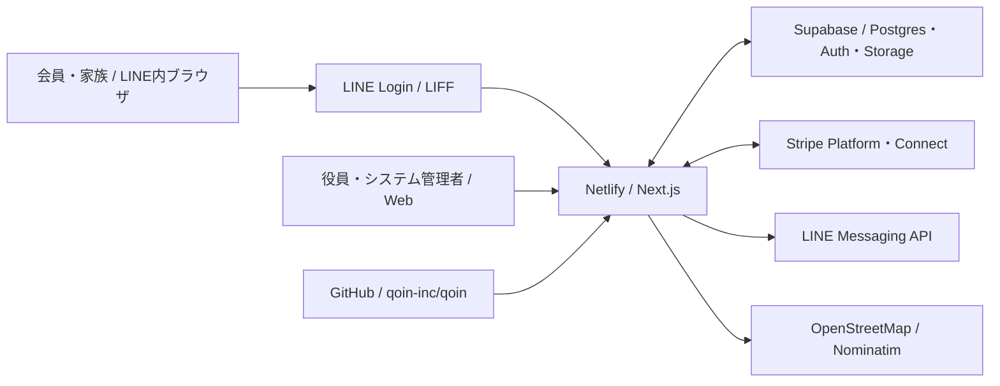

# el-town システム構成・災害復旧手順書

- スナップショット日: **2026-09-27（JST）**
- 対象: 現行の本番システムと、未構築の検証環境の分離計画
- 本番URL: `https://el-town.jp`
- ソース: `https://github.com/qoin-inc/qoin.git` / `deploy-ui-restore`
- アプリ実装の確認コミット: `f7287c0debebde77cd8cd050ae51c09359de117e`
- 最終の検証済み本番デプロイ: `6ab70d2e7189d8199f4df688`（2026-09-26 JST、上記コミット）
- 作業ディレクトリ: `C:\Users\info\Documents\Codex\projects\el-town`

この文書は、リポジトリの2026-09-27時点の実装と、ローカルの承認付きデプロイ履歴を照合した構成記録である。Supabase・Stripe・LINE・Netlifyの管理画面に保存された設定値、実データ、課金プラン、バックアップの実行状態を全面的に照合した記録ではない。秘密値や個人情報は記載しない。

## 1. 現状と復旧可能性

el-townは **Next.js 14 / React 18 / TypeScript** の1つのWebアプリである。Netlifyで配信し、Supabase Postgres・Auth・Storage、LINE Login/LIFF・Messaging API、Stripe Platform・Connectに接続する。現在確認できる公開先は `el-town.jp` の本番サイトで、独立した検証用NetlifyサイトとSupabase Projectはまだ作成されていない。

GitHubからコード、画面、API、差分migration、静的資産、デプロイスクリプトと資料を復元できる。一方、**Gitだけで本番を完全復元することはできない**。本番DBの全行・Authデータ、Storageのファイル実体、外部サービスのオブジェクトと設定、秘密値、DNSと組織権限は別の保全が必要である。現在の `supabase/migrations` と `docs/sql` は完全な初期スキーマではなく、空のSupabase Projectへ適用するだけで本番相当になる保証はない。

| 現在確認できる状態 | 根拠 |
|---|---|
| 本番URLは `https://el-town.jp` | `deploy.config.json` と検証済みデプロイ履歴 |
| 本番デプロイのコミット・build ID・deploy ID照合は成功 | 2026-09-26の `.deploy/deployments.jsonl`（ローカル、Git管理外） |
| 独立した検証環境は未作成 | 2026-09-27の利用者確認。Netlify previewは独立した検証サイトの代わりではない |
| `.env.local` はGit追跡中 | `git ls-files .env.local`。秘密値を本書に転記しない |
| 初期スキーマのbaseline migrationは未整備 | `supabase/migrations` と `docs/sql` の確認 |

## 2. システム全体像



| 層 | 実装・責務 |
|---|---|
| 画面 | `app/`、`components/`、`styles/`。会員、役員、システム管理、地域ポータル、マニュアル |
| サーバー | Next.js Route Handlers `app/api/`、Netlify Scheduled Functions `netlify/functions/` |
| データ | Supabase Postgres、Auth、Storage。業務表の団体識別は主に `neighborhood_id` |
| 決済 | Stripe Platformでシステム利用料、Connect Expressで団体会費 |
| LINE | LIFFで会員画面に入り、Messaging APIで役員からのプッシュ通知を送信 |
| ソース・配信 | GitHub `qoin-inc/qoin`、Netlify site `el-town`、独自ドメイン `el-town.jp` |

## 3. 開発・ビルド構成

| 項目 | 2026-09-27の確認値 |
|---|---|
| ローカルOS / shell | Windows / PowerShell |
| ローカルNode.js / npm | `v24.14.1` / `11.11.0` |
| Git | `2.54.0.windows.1` |
| Dev Container | Node 22イメージ |
| GitHub Actions | Node 20指定。現行構成と不一致で、成功するCIとは見なせない |
| Next.js / React | `14.2.5` / `18.3.1` |
| Supabase JS / Stripe / LIFF | `2.44.4` / `^13.0.0` / `^2.25.0` |
| TypeScript | `6.0.3` |

`package-lock.json` を正本として `npm ci` を使う。`package.json` には `dev`、`build`、`start`、`deploy:plan`、`deploy:approved` があり、`lint` と `test` のnpm scriptはない。App Routerが中心で、`pages/admin/budget.tsx` はPages Routerの画面として残る。Nodeのバージョンはローカル24、Dev Container 22、CI 20で不一致であり、復旧手順では実際に成功したバージョンを記録して固定する必要がある。

```powershell
git clone https://github.com/qoin-inc/qoin.git el-town
Set-Location el-town
git switch deploy-ui-restore
git rev-parse HEAD
npm ci
npm.cmd run build
```

上記の `git rev-parse` がこの文書の確認コミット、または承認済みの後継コミットを指すことを確認する。復旧のため過去コミットへ戻す場合は、detached HEADのまま開発せず復旧用ブランチを作る。

## 4. GitHub・Netlify・デプロイ

`origin` は `https://github.com/qoin-inc/qoin.git`。現在の作業ブランチは `deploy-ui-restore` である。GitHubへのpushとremote HEADの一致確認は `AGENTS.md` の要件。GitHub以外にも暗号化したmirror backupを保管する。

Netlifyは `netlify.toml` の `npm run build` と `.next`、`@netlify/plugin-nextjs` を使う。`deploy.config.json` は本番サイト `el-town`、公開URL `https://el-town.jp`、承認有効期限15分を指定する。`scripts/safe-netlify-deploy.mjs` が計画・承認・実行・公開後の照合を担当する。

**デプロイ手順:**

1. 実装をコミットし、対応するGitHubブランチへpushしてHEADを照合する。
2. `npm.cmd run build` を成功させる。
3. 本番なら `npm.cmd run deploy:plan -- --prod` を実行する。
4. 利用者が出力された `APPROVE DEPLOY ...` を完全一致で返信した場合だけ `deploy:approved` を実行する。
5. 公開URL、コミット、build ID、deploy IDを照合する。失敗・期限切れ・ビルド変更後は新しい計画と承認を得る。

2026-09-26の最終デプロイは `f7287c0d...`、deploy ID `6ab70d2e7189d8199f4df688`、最終build ID `6z4QMWeAgAH4V5kZr9jnP` として照合済み。これ以後の外部変更は本書で未検証である。`.deploy/` はGit管理外のローカル証跡なので、災害時に依存しない。

**Scheduled Functions:** `system-usage-snapshot.mts` は毎月16日00:00 UTC、`system-usage-invoice.mts` は毎月1日00:00 UTCに設定されている。請求を停止する場合は `SYSTEM_BILLING_ENABLED=false` を維持し、Stripe側の既存請求の状態も別途確認する。

**現行CIの問題:** `.github/workflows/ci.yml` は `main`・`develop` だけを対象にし、存在しない `npm run lint`、`npm test`、`scripts/backup-db.sh` を呼ぶ。デプロイ先も現在の `.next` と異なる `./out` で、監視パスに `app/`、`lib/`、`netlify/` 等がない。現行のビルド・バックアップ・本番公開の成功証拠として扱わない。

## 5. 環境分離の状態と予定構成

| 役割 | 現状 / 予定 | データ・外部連携 |
|---|---|---|
| ローカル開発 | 既存PC。`.env.local` の接続先を作業前に確認 | 本番DBへ書き込まない運用が必要 |
| 検証 | **未作成**。別Netlify siteと別Supabase Projectを予定 | 架空データ、Stripe Sandbox、検証用LINE/LIFF、専用Webhook |
| 本番 | 既存 `el-town.jp` と既存Supabase Project | 実データ、本番Stripe、本番LINE |

アプリのリポジトリは1つを維持し、同じ承認済みコミットを環境別設定でそれぞれビルドする。検証環境で確認後に本番へ反映する。検証DBへ本番の個人情報を複製しない。検証用Supabase Projectは別課金が発生し得るため、作成前に契約プランと費用を確認する。

**分離前のコード・構成課題:**

1. `netlify.toml` の `[build.environment]` に本番の `NEXT_PUBLIC_LIFF_ID` が固定される。`app/portal/page.tsx` にも同じLIFF IDのフォールバックがある。検証サイトが本番LINEへ接続しないよう、サイト別設定へ変更する。
2. `app/api/fees/create-checkout-session/route.ts` と `app/api/admin/stripe/create-account-link/route.ts` は `NODE_ENV === "production"` をStripe本番キーの判定に使う。検証サイトも本番ビルドになるため、明示的なアプリ環境判定へ変更する。
3. 承認付きデプロイスクリプトと `deploy.config.json` は現状1つの本番siteを前提とする。検証site IDを明示し、サイトを取り違えない計画・照合を追加する。
4. 完全なbaseline migration、Data APIの必要なGRANT、RLS・Storage Policy、架空seedを整備し、空の検証Projectに再現できるようにする。

検証用のNetlify site ID、Supabase Project Ref、LINE公式アカウント・Messaging API channel・LINE Login channel・LIFF ID、Stripe Sandboxの接続先とWebhook secretは本番とは別に管理する。IDと秘密値を混同せず、秘密値は環境変数管理に保存する。

## 6. 環境変数・秘密情報

| 区分 | 主な名前 | 用途 |
|---|---|---|
| ブラウザ公開 | `NEXT_PUBLIC_SUPABASE_URL`, `NEXT_PUBLIC_SUPABASE_ANON_KEY`, `NEXT_PUBLIC_LIFF_ID`, `NEXT_PUBLIC_BASE_URL`, `NEXT_PUBLIC_APP_URL` | 接続先とLIFF。`NEXT_PUBLIC_*` はビルドに組み込まれる |
| Supabaseサーバー | `SUPABASE_SECRET_KEY` または互換の `SUPABASE_SERVICE_ROLE_KEY` | Webhook、管理API、定期処理。ブラウザへ渡さない |
| Stripe | `STRIPE_SECRET_KEY`, `STRIPE_WEBHOOK_SECRET`, `STRIPE_CONNECT_WEBHOOK_SECRET` | 本番またはSandboxのAPIと署名照合 |
| LINE | `LINE_CHANNEL_ACCESS_TOKEN` または互換名 `LINE_MESSAGING_CHANNEL_ACCESS_TOKEN` | Messaging API送信 |
| system管理 | `SYSTEM_LOGIN_ID`, `SYSTEM_LOGIN_PASSWORD`, `SYSTEM_SESSION_SECRET`, `SYSTEM_ADMIN_EMAIL` | `/system` 認証とセッション |
| 定期請求 | `SYSTEM_BILLING_CRON_SECRET`, `SYSTEM_BILLING_ENABLED` | ジョブ認証と実行スイッチ |
| デプロイ | `NETLIFY_AUTH_TOKEN` | ローカルの承認付きデプロイ用。アプリRuntimeへ不要 |

`.env.local` は `.gitignore` に載っているが、**現時点でもGit追跡中**である。値や履歴を本書に載せない。既存の秘密値の棚卸し・失効/ローテーション、追跡解除、必要なら履歴上の露出対応を、関係者と調整した独立したセキュリティ作業として扱う。

## 7. 画面・API・主要業務

| 主なURL | 用途 |
|---|---|
| `/`、`/resident`、`/resident/proxy`、`/resident/receipt` | 初期メニュー、会員画面、委任状、領収書 |
| `/admin`、`/admin/stripe/return`、`/admin/stripe/refresh` | 役員画面、Stripe Connect onboarding |
| `/system` | el-townシステム管理・使用料管理 |
| `/portal`、`/richmenu`、`/manual/*` | 地域ポータル、LINE関連、操作マニュアル |
| `/api/admin/publish-line` | LINEプッシュ |
| `/api/fees/create-checkout-session`、`/api/webhooks/stripe` | 会費Checkout、Stripe platform/Connect Webhook |
| `/api/system-usage/*` | 使用料の設定、Stripe支払、請求・銀行振込処理 |
| `/api/system/session` | system管理者セッション |

主な業務機能は、団体登録・役員招待、名簿・家族LINE連携、回覧とLINE通知、イベント・施設・Live、地域投稿、総会・会計、会費とシステム使用料である。

**2026-07-19版からの主な追加・変更:**

- 会費に年度確定・再確定、年度スナップショット、ロック後入金と訂正監査を追加。
- 総会会計に年度確定・スナップショット・訂正監査を追加。
- 会費のカード・PayPay・Stripe銀行振込設定と入金反映、商取引表示・審査状態を拡張。
- 会員は「集金希望」を設定でき、役員の会費一覧では未納の集金希望世帯を絞り込める。
- システム使用料の銀行振込先・入金確認・発行者・料金履歴関連APIを追加。
- 会員・役員向けマニュアルとStripeヘルプを更新。

`components/AdminView.tsx`、`components/ResidentView.tsx`、`styles/design.css` は大きく、復旧時には先に基準コミットの挙動を戻し、分割は別作業にする。

## 8. Supabase・認証・RLS

主な表: `neighborhoods`, `neighborhood_admins`, `resident_rosters`, `circulars`, `public_posts`, `fee_records`, `neighborhood_fee_settings`, `fee_year_closures`, `fee_year_snapshot_rows`, `assembly_year_closures`, `assembly_year_snapshots`, `system_usage_billings`, `system_usage_payment_profiles`, `fee_stripe_sessions`, `fee_stripe_payments`。Storage `attachments` はファイル実体とbucket設定・Policyの両方を復元する。表・関数の完全一覧はDBの実スキーマから取得する必要がある。

2026-09-27時点で `supabase/migrations` は12本、`docs/sql` は40本あるが、多くは既存表への差分である。**本番と同じ空ProjectをGitだけで作るbaselineはない**。schema、roles、data、Auth、Storage実体と外部設定を別々に保全・復元検証する。migrationの適用済み状態は本番DBで未照合であり、ファイルの存在を適用済みの証拠としない。

役員はSupabase Authと `neighborhood_admins` の団体権限で認可する。会員はLIFFのLINE user IDを疑似メール `@line.eltown.local` に変換したSupabase Authユーザーと名簿の本人・家族列を連携する。現状はクライアント側の予測可能な認証情報に依存するため、資料の計画どおり、LIFF ID tokenのサーバー検証方式へ移行する必要がある。

`/system` は独自ログインとSupabase側の管理セッションを併用する。`lib/systemAdminServer.ts` には環境変数が欠けた場合の既定ログインID・パスワード・セッション秘密のフォールバックが残る。本番では未設定時に拒否する修正が優先事項である。Supabaseのブラウザ公開キーは秘密ではなく、全業務表・StorageのRLS/PolicyとGRANTが実際の認可境界になる。

## 9. 外部サービス台帳と復元対象

| サービス | コード外で保全するもの |
|---|---|
| Supabase | Project Ref、region、plan、DB roles/schema/data・Auth、Storage実体、bucket/Policy、Site URL、Redirect URL、メール設定 |
| Netlify | Site ID、ドメインとDNS、環境変数、ビルド設定、deploy履歴、Scheduled Functions |
| Stripe | Platform・Connectアカウント対応、Customer/Invoice/Checkout/PaymentIntent、API key、Platform/Connect Webhook endpointと署名 |
| LINE | Provider、LINE Login channel、LIFF IDとEndpoint URL、公式アカウント、Messaging API channel、token、リッチメニューとリンク |
| GitHub | リポジトリと全履歴、ブランチ、権限、Actions secrets。別媒体へのmirror backup |

本番のStripe Webhook URLは `https://el-town.jp/api/webhooks/stripe`。検証環境を作るときは専用URLとSandbox secretを設け、Connectアカウントを本番と共有しない。LINEも検証用公式アカウント・LIFF・チャネルを別にし、本番会員を検証用名簿へ複製しない。

## 10. 災害復旧手順

### A. 初動

1. 障害範囲をGitHub、Netlify、Supabase、Stripe、LINE、DNSに分ける。不正アクセス疑いでは書き込み・請求・一括送信を止め、証跡を保全する。
2. `SYSTEM_BILLING_ENABLED=false` を確認する。Stripe側で確定済みの請求・決済は別に照合し、再実行で二重請求しない。
3. 復旧目標のコミット、最新の検証済みdeploy ID、DB復元点、Storage backupの時刻を確定する。

### B. コードとNetlify

1. GitHubまたは外部mirrorからcloneし、承認済みコミットを確認する。
2. `npm ci` と `npm.cmd run build` を実行する。
3. Site ID、環境変数、ドメイン、Next.js plugin、Scheduled Functionsを復元する。本番・検証の秘密値を混ぜない。
4. `docs/admin/safe-deployment.md` と `AGENTS.md` の承認付き手順で公開し、URL・コミット・build ID・deploy IDを照合する。

### C. Supabase

1. 利用可能なPITR・managed backupを確認する。新Projectへ復旧する場合はregion、Postgres version、extensionを合わせる。
2. roles、schema、data、Auth関連データ、RLS/Policy、GRANT、関数・trigger・indexを復元し、主要表の件数と権限を照合する。
3. Storage `attachments` の実ファイルを別バックアップから戻す。DB backupのmetadataだけでは足りない。
4. Auth Site URL、Redirect URL、メール設定、Project URLとキーを接続先に反映し、認証の再ログイン要否を確認する。

### D. Stripe・LINEと段階再開

1. StripeのPlatform/Connect署名とアカウント対応を照合し、Connectを重複作成しない。
2. LINE LIFF Endpoint URL、Messaging API token、友だち追加・リッチメニューのリンクを照合する。
3. 管理者・会員各1名でログインと団体分離を確認し、回覧、添付、限定LINE通知、会費Checkout/Webhook、施設・Live、年度確定を順に試す。
4. システム利用料は請求額・時期・入金を手動確認してから定期請求を再開する。

## 11. 復旧後の合格条件

| 分野 | 合格条件 |
|---|---|
| ソース・ビルド | 承認済みコミットと一致し、`npm run build` 成功 |
| 公開 | URL、deploy ID、build ID、commit IDが一致 |
| 認証・認可 | 役員・会員・systemが正しく入り、他団体を参照・更新できない |
| DB・Storage | 主要件数、RLS/GRANT、添付の表示・アップロードが正しい |
| LINE | 対象団体の限定会員へ1通だけ届き、失敗が追跡できる |
| Stripe | Connect状態、テスト決済または限定本番決済、Webhook、会計反映が一致 |
| 会費・総会 | 年度状態、集金希望、入金、スナップショット、訂正履歴が正しい |
| 定期処理 | 停止時は請求しない。再開後は件数・金額・税・入金が一致 |

## 12. 優先改善事項と文書の限界

| 優先度 | 未完了事項 |
|---|---|
| P0 | `.env.local` のGit追跡と秘密値の履歴上の露出を調査し、ローテーション・追跡解除を実施 |
| P0 | 本番DBの完全なroles/schema/data・AuthバックアップとStorage実体の外部バックアップを作成・復元試験 |
| P0 | 会員認証をサーバー検証へ変更し、system管理の既定資格情報を廃止 |
| P0 | 全表・Storageの団体分離、RLS・GRANTを監査・回帰試験 |
| P1 | 検証Netlify・Supabase・Stripe Sandbox・LINEを分離し、baseline migrationと架空seedを用意 |
| P1 | CIのbranch、コマンド、監視パス、デプロイ方式を現行構成へ修正 |
| P1 | Nodeバージョンをローカル・CI・Netlifyで統一 |
| P1 | LINE配信・Stripe Webhook・月次請求のジョブ化、監視、重複防止と監査ログ |

バックアップの取得有無と復元成功、外部サービスの現在の契約・設定・権限は本書作成時点で未確認である。期限や料金、各サービスのAPI仕様は復旧時に公式管理画面・公式資料で再確認する。過去の2026-07-19版は `docs/reports/old/` に原本のまま保存する。

## 関連資料

- `docs/admin/safe-deployment.md`、`AGENTS.md`
- `docs/reports/operations_architecture_100_towns_action_plan_2026-08-20.md`
- `docs/reports/operations_architecture_100_towns_environment_costs_ids_codex_2026-09-25.md`
- `docs/reports/operations_architecture_scalability_codex_2026-08-19.md`
- `supabase/migrations/`、`docs/sql/`
- [Supabase環境管理](https://supabase.com/docs/guides/deployment/managing-environments)
- [Netlify環境変数](https://docs.netlify.com/build/environment-variables/overview/)
