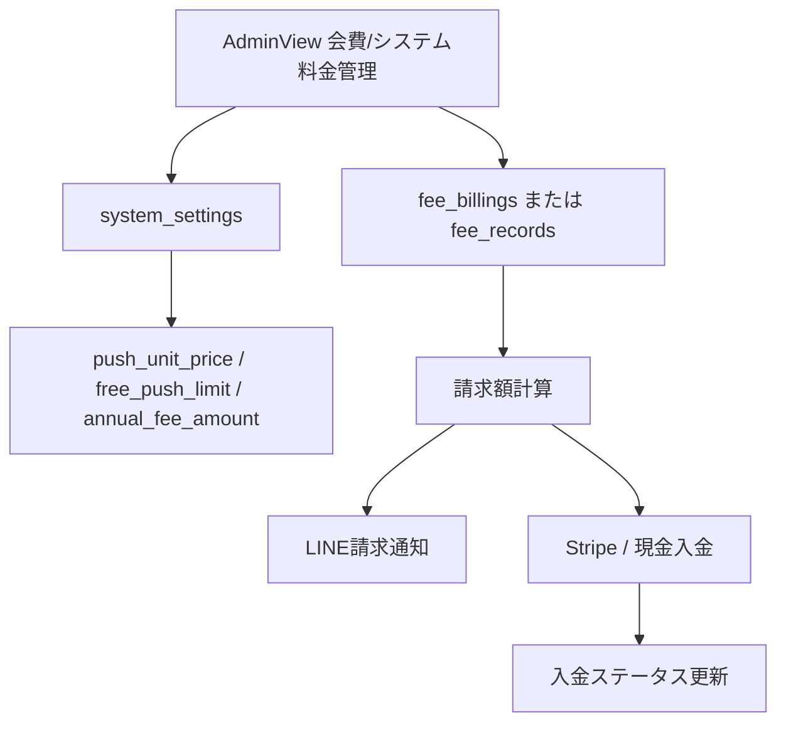
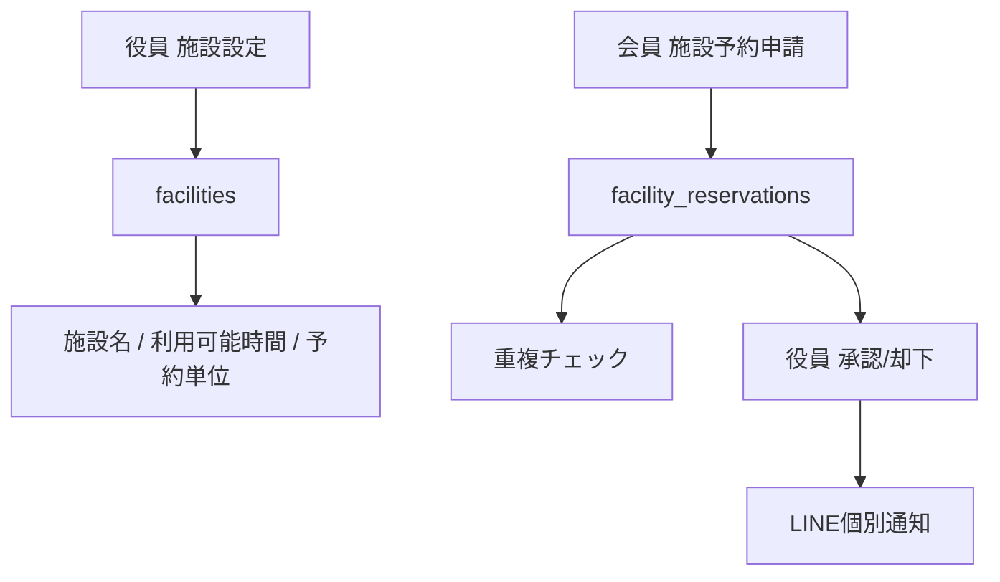
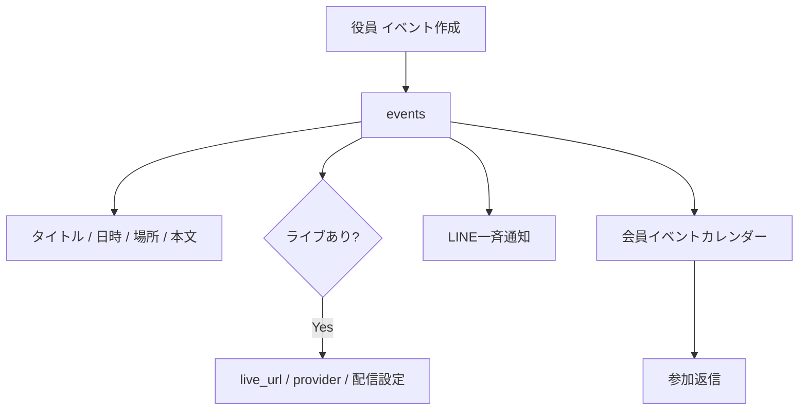
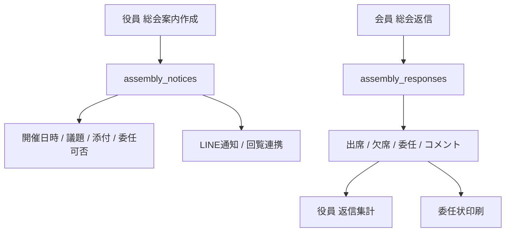
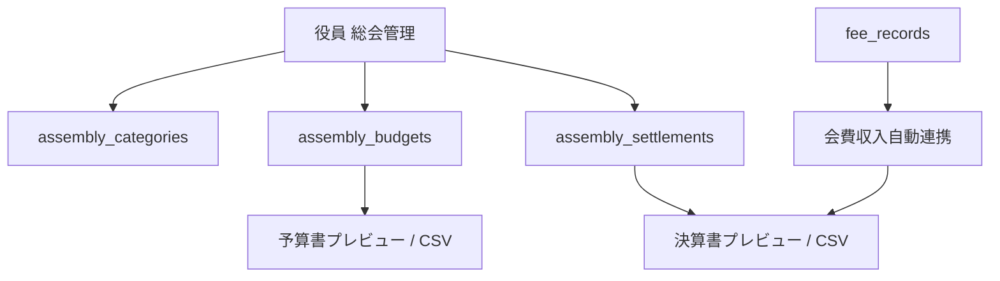
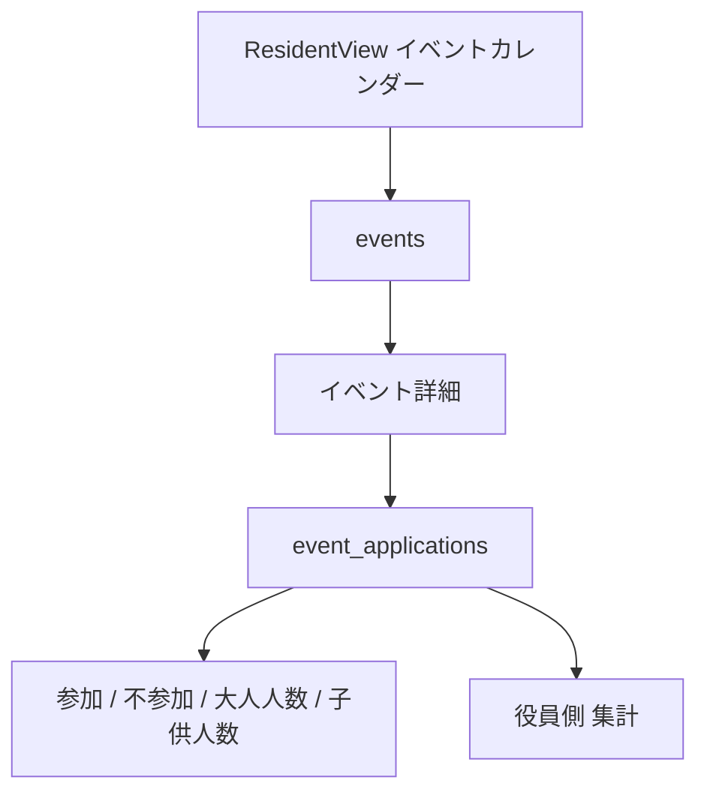
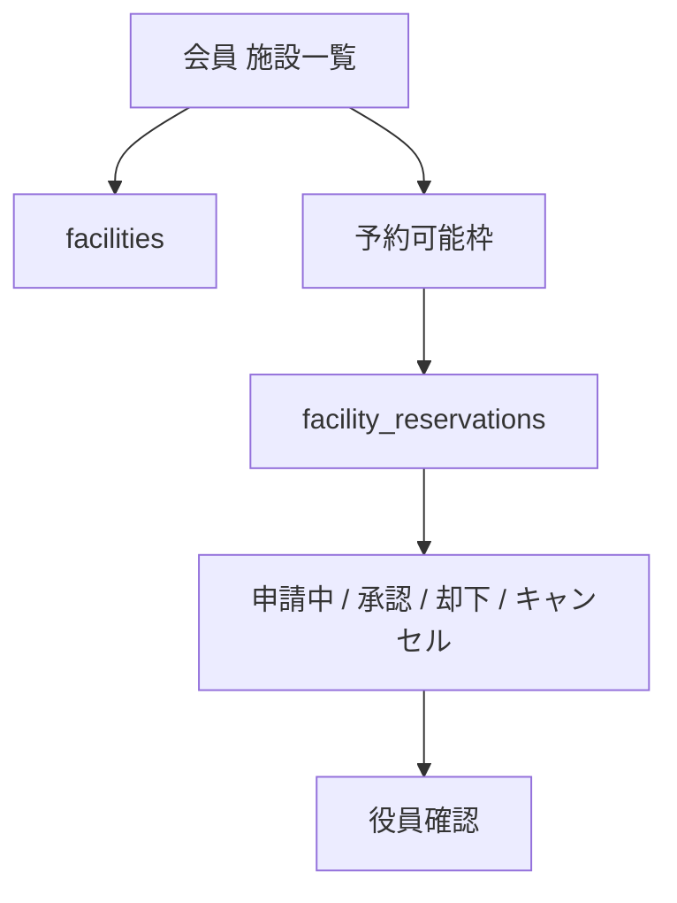
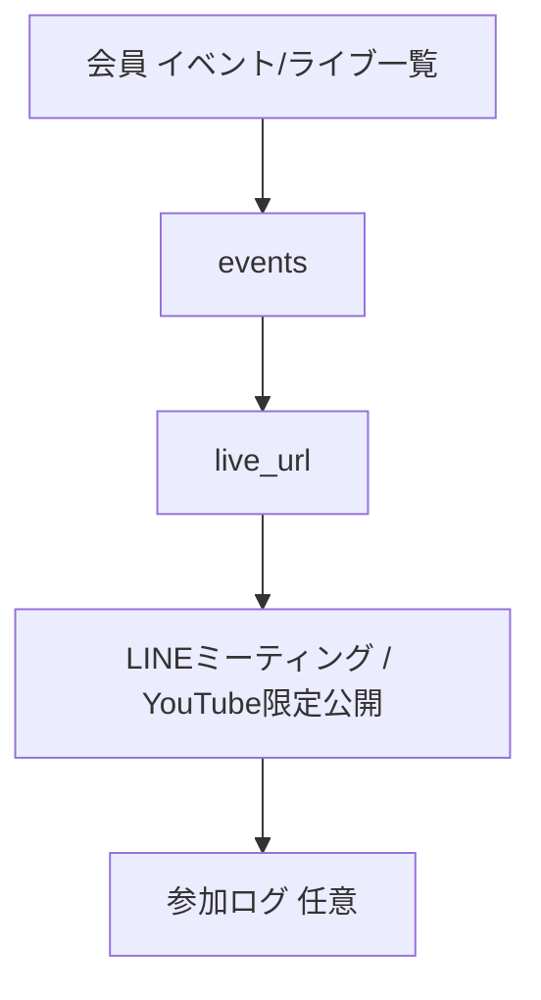
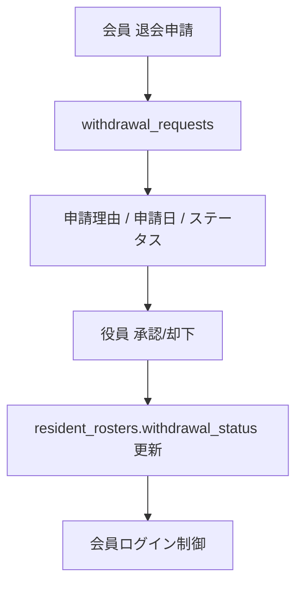
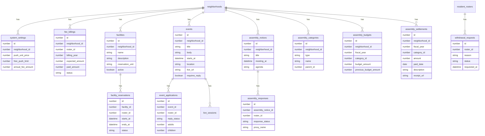

# el-town 機能別システム構成図 追加確認版

作成日: 2026-07-06  
対象ソース: `qoin-inc/qoin` `main` 相当の `C:\Users\info\.gemini\antgravity`  
位置づけ: `docs/system_architecture_by_feature.md` の追加確認資料

## 1. 確認方針

今回の確認では、指定された不足候補機能がソース上に存在するかを確認しました。判定は次の3層で分けています。

| 区分 | 意味 |
|---|---|
| アクティブ実装 | `app/`, `components/`, `pages/`, `lib/` 配下にあり、現在のNext.jsアプリから参照される実装。 |
| 未統合ソース断片 | `scratch/` 配下などに復旧用・移植用のコード断片として存在するが、現在のアプリには接続されていないもの。 |
| マニュアルのみ | `app/manual/*` に説明や画面例はあるが、実処理・DB更新・APIが見つからないもの。 |

## 2. 追加確認サマリー

| 領域 | 指定機能 | 判定 | 確認結果 |
|---|---|---|---|
| 役員管理 | システム料金の計算・請求機能 | 一部断片あり / アクティブ不足 | `scratch/migration.sql` に `system_settings`、`scratch/check_billings.js` に `fee_billings` 参照あり。現アプリでは `AdminView` の会費集計のみ。 |
| 役員管理 | 施設予約設定機能 | 不足 | `AdminView` のイベントカード説明と `app/manual/live/page.tsx` の説明のみ。施設・予約テーブル/API/UIは未確認。 |
| 役員管理 | イベント発信 | 不足 | マニュアル説明はあるが、役員画面のイベント作成・配信処理は未確認。`public_posts` の地域投稿とは別機能。 |
| 役員管理 | ライブ発信 | マニュアルのみ | `app/manual/live/page.tsx` にYouTube/LINEミーティング連携手順の説明あり。ライブ予定の保存・発信機能は未確認。 |
| 役員管理 | 総会案内・返信機能 | 不足 | 委任状印刷ページはあるが、総会案内配信、出欠/委任返信の保存処理は未確認。 |
| 役員管理 | 総会予算・決算作成機能 | 未統合ソース断片あり | `scratch/assembly_backend.tsx` と `scratch/assembly_ui.tsx` に科目、予算、決算、CSV、会費収入連携の断片あり。現アプリには未接続。 |
| 会員機能 | イベントカレンダの参加返信機能 | マニュアルのみ / アクティブ不足 | `app/manual/member/page.tsx` に参加人数入力の説明あり。会員画面の実UI・保存先は未確認。 |
| 会員機能 | 施設予約機能 | マニュアルのみ / アクティブ不足 | `app/manual/live/page.tsx` に説明あり。会員からの施設予約申請UI/APIは未確認。 |
| 会員機能 | ライブ参加機能 | マニュアルのみ / アクティブ不足 | ライブ参加説明はあるが、会員画面から参加URLを開く実装は未確認。 |
| 会員機能 | 退会申請機能 | 一部実装 / 申請は不足 | `withdrawal_status === withdrawn` の利用停止判定はある。会員から退会申請するUI/APIは未確認。 |

## 3. 役員側の追加構成

### 3.1 システム料金の計算・請求

現状:
- アクティブ実装では、`components/AdminView.tsx` が `fee_records` を集計し、未納件数と入金額を表示します。
- `scratch/migration.sql` に `system_settings` テーブル作成案があります。
- `scratch/check_billings.js` は `fee_billings` テーブルを参照しますが、アクティブアプリからの利用は未確認です。
- `scratch/apply_fix.js` などに `annual_fee_amount`、`expected_amount` を扱う復旧断片があります。

追加想定構成:

必要な追加確認:
- `fee_billings` がSupabase本番に存在するか。
- システム利用料と町内会費を同じ `fee_records` で扱うのか、別テーブルに分けるのか。
- LINE請求通知とStripe決済ステータスのDB反映設計。

### 3.2 施設予約設定

現状:
- `components/AdminView.tsx` のイベントカード説明に「施設予約」という文言があります。
- `app/manual/live/page.tsx` に施設予約管理の説明があります。
- `facilities`、`facility_reservations`、`reservations` などのアクティブ実装は未確認です。

追加想定構成:

必要な追加実装:
- 施設マスタ管理。
- 予約枠、重複チェック、承認/却下。
- 会員側の予約申請・予約状況確認。

### 3.3 イベント発信・ライブ発信

現状:
- `app/manual/admin/page.tsx` に「お知らせ・回覧板・イベントを作成」という説明があります。
- `app/manual/live/page.tsx` にライブ配信URL登録や施設予約と通知の説明があります。
- アクティブ実装では `components/AdminView.tsx` にイベントカードがあるだけで、イベント作成画面やDB保存処理は未確認です。
- `app/portal/page.tsx` の `public_posts` は地域投稿であり、役員のイベント発信機能とは別扱いが妥当です。

追加想定構成:

必要な追加実装:
- イベント作成・編集・削除。
- ライブ参加URLの保存と会員側表示。
- LINE一斉通知、または通知キュー。
- 会員側のカレンダー表示・参加返信。

### 3.4 総会案内・返信

現状:
- `app/resident/proxy/page.tsx` に総会向けの委任状印刷があります。
- 総会案内を配信し、出席/欠席/委任/議決返信を保存する実装は未確認です。
- `scratch/assembly_*` は予算・決算に寄っており、総会案内返信そのものは未確認です。

追加想定構成:

必要な追加実装:
- 総会案内の作成・配信。
- 会員返信フォーム。
- 返信集計、委任状との連携。

### 3.5 総会予算・決算作成

現状:
- アクティブ実装では `pages/admin/budget.tsx` と `components/BudgetForm.tsx` が存在しますが、保存先の `/api/budget` は未確認です。
- `scratch/assembly_backend.tsx` には以下の未統合断片があります。
  - `assembly_categories` 取得/追加/更新/削除。
  - `assembly_budgets` 取得/保存。
  - `assembly_settlements` 取得/登録/削除。
  - `fee_records` から会費収入を自動集計。
  - 予算CSV、決算CSV出力。
- `scratch/assembly_ui.tsx` には科目設定、予算書作成、実績・決算入力、決算書作成のUI断片があります。

追加構成案:

扱い:
- ソース断片は存在しますが、現アプリには未統合です。
- 現在の `components/AdminView.tsx` は総会モーダルや `assembly_*` テーブルを参照していません。
- 復旧する場合は、`scratch/apply_assembly_logic.js`、`scratch/apply_assembly_ui.js` の前提パスが古いため、そのまま実行せず、現行 `AdminView.tsx` に合わせて手作業で再統合する必要があります。

## 4. 会員側の追加構成

### 4.1 イベントカレンダの参加返信

現状:
- `app/manual/member/page.tsx` にイベント参加人数入力の説明があります。
- アクティブ会員画面 `components/ResidentView.tsx` は `home`、`notice`、`payment`、`profile` の4タブのみです。
- イベントカレンダー、イベント詳細、参加返信保存処理は未確認です。

追加想定構成:

必要な追加実装:
- 会員画面へのイベント/カレンダータブ追加。
- `event_applications` など参加返信テーブル。
- 役員側の参加者集計画面。

### 4.2 施設予約

現状:
- マニュアル上の説明のみ確認。
- 会員側の予約申請、予約履歴、キャンセル申請は未確認です。

追加想定構成:

### 4.3 ライブ参加

現状:
- `app/manual/live/page.tsx` にライブ参加URLの扱い説明があります。
- 会員画面にライブ予定一覧や参加ボタンは未確認です。

追加想定構成:

### 4.4 退会申請

現状:
- `app/resident/page.tsx` と `app/portal/page.tsx` に `withdrawal_status === withdrawn` の利用停止判定があります。
- `scratch/check_withdrawal.js` は名簿の退会状態を確認する調査スクリプトです。
- 会員から退会申請を登録するUI/API、役員が承認するUI/APIは未確認です。

追加想定構成:

必要な追加実装:
- 会員側の退会申請フォーム。
- 役員側の申請一覧と承認/却下。
- 承認時の `resident_rosters.withdrawal_status` 更新。

## 5. 追加データモデル案

以下は、今回の確認結果から不足機能を正式実装する場合の追加候補です。既存DBに存在するかはSupabase本番側の確認が必要です。

## 6. 画面・API追加候補

| 区分 | 候補パス | 役割 | 現状 |
|---|---|---|---|
| 役員 | `/admin/system-fees` または管理モーダル内 | システム料金計算・請求 | 未実装。断片は `scratch` にあり。 |
| 役員 | `/admin/facilities` | 施設マスタ、予約承認 | 未実装。 |
| 役員 | `/admin/events` | イベント作成、参加集計、ライブURL登録 | 未実装。マニュアルのみ。 |
| 役員 | `/admin/assemblies` | 総会案内、返信集計、予算・決算 | 予算・決算断片のみ `scratch` にあり。 |
| 会員 | `/resident?tab=events` | イベントカレンダー、参加返信、ライブ参加 | 未実装。 |
| 会員 | `/resident?tab=facilities` | 施設予約申請 | 未実装。 |
| 会員 | `/resident?tab=profile` 内 | 退会申請 | 利用停止判定のみ。申請は未実装。 |
| API | `/api/admin/system-fees/*` | 料金計算・請求通知 | 未実装。 |
| API | `/api/admin/events/*` | イベント/ライブ作成・通知 | 未実装。 |
| API | `/api/facilities/*` | 施設予約 | 未実装。 |
| API | `/api/assemblies/*` | 総会案内・返信・予算決算 | 未実装。 |

## 7. 次フェーズ推奨順

| 優先度 | 作業 | 理由 |
|---|---|---|
| P0 | アクティブ実装と `scratch` 断片の扱いを決める | 総会予算・決算は復旧断片が大きいため、捨てる/移植する判断が先。 |
| P0 | `/api/budget` または総会予算APIの正式化 | 現在の予算画面は存在しないAPIを呼ぶ。 |
| P1 | イベント/参加返信のDBと会員タブを設計 | 会員側不足機能の中心で、ライブ参加や総会案内にも流用できる。 |
| P1 | 施設予約のDBと承認フローを設計 | 管理者・会員双方にまたがるため先にデータモデルを固定する。 |
| P1 | 退会申請フローを追加 | 退会済みブロックは既にあるため、申請と承認をつなげやすい。 |
| P2 | システム料金/請求を会費管理と分離するか決める | `fee_records`、`fee_billings`、`system_settings` の責務整理が必要。 |

## 8. 確認メモ

- `components/AdminView.tsx` にあるイベント、会費、予算カードは現時点では詳細機能へ接続されていません。
- `app/manual/*` にはイベント、ライブ、施設予約、参加返信、会費請求の説明がありますが、実装済み機能とは別に扱う必要があります。
- `scratch/assembly_backend.tsx` と `scratch/assembly_ui.tsx` は総会予算・決算の有力な復旧元ですが、現在のNext.jsアプリからは参照されていません。
- `scratch/migration.sql` の `system_settings` はシステム料金・年会費設定の手掛かりですが、現アプリでは未使用です。
